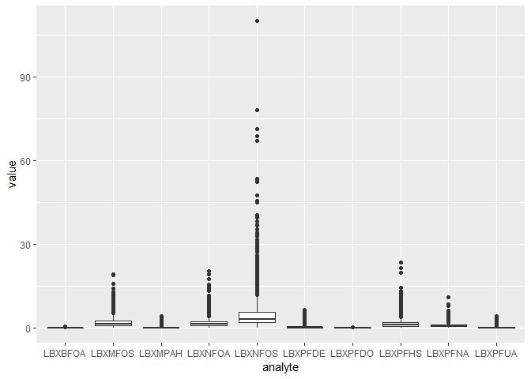
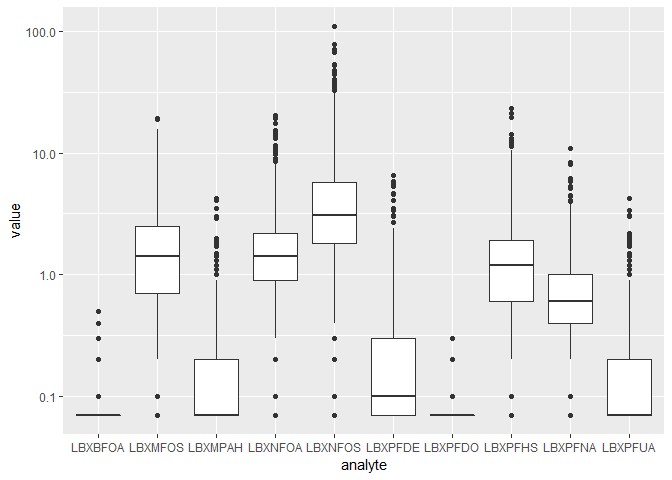
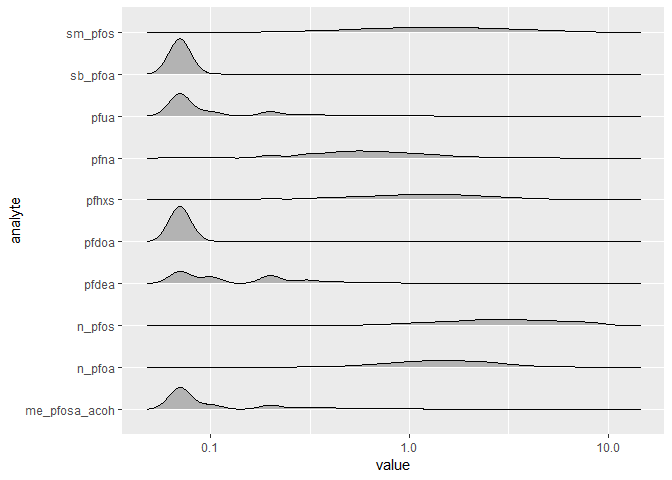
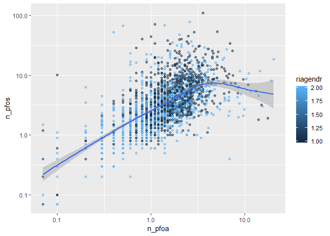

aamehs\_proposal
================
Team LSD
February 7, 2019

Per- and polyfluoroalkyl substances (PFAS)
==========================================

Background
----------

Per- and polyfluoroalkyl substances (PFAS) are human-made compounds that have been used commercially and industrially for over sixty years due to their ability to repel oil and water, withstand elevated temperatures, and resist chemical reactions \[1\]. Of the thousands of different PFAS compounds, perfluorooctanoic acid (PFOA) and perfluorooctane sulfonate (PFOS) are the most studied. PFASs are used in stain-resistant coatings for upholstery and carpeting, water-resistant breathable clothing, greaseproof food packaging, in the manufacturing process of non-stick cookware, and in aqueous film-forming foams (AFFF) – used to fight petroleum fires at commercial airports and military airfields. These chemicals are extremely persistent in the environment and have been detected in the blood of nearly all sampled Americans \[2\]. Exposure to PFASs may increase risk of pregnancy-induced hypertension, liver damage, higher cholesterol, thyroid disease, asthma, decreased vaccine antibody response, decreased fertility, and decreased birth weight \[3\].

``` r
knitr::include_graphics("pfoa_studies.png")
```


<p class="caption">
Overview of the Number of Studies Examining PFOA Health Effects (ATSDR, June 2018)
</p>

\[1\] G. B. Post, J. A. Gleason, and K. R. Cooper, “Key scientific issues in developing drinking water guidelines for perfluoroalkyl acids: Contaminants of emerging concern,” PLoS Biol., vol. 15, no. 12, pp. 1–12, Dec. 2017.
\[2\] U. E. N. C. for E. Assessment, “Fourth national report on human exposure to environmental chemicals, updated tables, March 2018, volume one,” WEB SITE, Mar. 2009.
\[3\] Agency for Toxic Substances and Disease Registry (ATSDR), “Toxicological Profile for Perfluoroalkyls, Draft for Public Comment,” U.S. Department of Health and Human Services, Public Health Service, Atlanta, GA, Jun. 2018.

Hypotheses
----------

### 1. Water and food consumption and consumer product use influence PFAS serum concentrations.

IV: Survey Questions: drinking water sources, drinking water consumption, canned goods, microwave popcorn, beauty and personal care products (including dental floss)

DV: Serum PFAS concentrations (Outcome): PFDeA, PFHxS, Me-PFOSA-AcOH, PFNA, PFUA, PFDoA, n-PFOA, Sb-PFOA, n-PFOS, Sm-PFOS

### 2. Elevated PFAS concentrations contribute to higher BMI.

IV: Serum PFAS concentrations (Outcome): PFDeA, PFHxS, Me-PFOSA-AcOH, PFNA, PFUA, PFDoA, n-PFOA, Sb-PFOA, n-PFOS, Sm-PFOS

DV: Body weight, BMI

### 3. PFAS levels are associated with other chemicals in serum which are common pollutants at industrial sites or airfields (e.g. solvents, fuels/petroleum/oil/lubricants)

Independent Variables: ID solvents, POLs

Data Source: NHANES
-------------------

Accessed through `RNHANES` package.

<https://github.com/silentspringinstitute/RNHANES> <https://cran.r-project.org/web/packages/RNHANES/vignettes/introduction.html> <https://www.r-bloggers.com/nhanes-made-simple-with-rnhanes/>

Install RNHANES package

``` r
# library(devtools)
# install_github("silentspringinstitute/RNHANES")
```

``` r
library(tidyverse)
library(RNHANES)
```

NHANES files and the comprehensive variable list

``` r
files <- nhanes_data_files()  #1,328 obs of 10 variables
variables <- nhanes_variables()  #48,398 obs of 10 variables
```

``` r
files %>% count(cycle) %>% View
files %>% count(component)
```

    ## # A tibble: 5 x 2
    ##   component         n
    ##   <chr>         <int>
    ## 1 demographics     16
    ## 2 dietary          90
    ## 3 examination     141
    ## 4 laboratory      643
    ## 5 questionnaire   438

Download data files
-------------------

Example of data loaded from multiple files/cycle years. Download all files that contain a "PFOS" variable.

``` r
?RNHANES::nhanes_search
results <- nhanes_search(variables, "PFOS")
results$cycle
pfos <- nhanes_load_data(results$data_file_name, results$cycle, demographics = TRUE, recode = TRUE) #slow; large list, 9 elements, 12 MB

pfos
```

Load and Inspect PFAS data
--------------------------

NHANES Codebook References: <https://wwwn.cdc.gov/Nchs/Nhanes/2013-2014/PFAS_H.htm> <https://wwwn.cdc.gov/Nchs/Nhanes/2015-2016/PFAS_I.htm>

``` r
pfas_data <- nhanes_load_data("PFAS_I", "2015-2016", demographics = TRUE)
```

    ## Downloading PFAS_I.XPT to C:\Users\slewa\AppData\Local\Temp\RtmpOIgvJc/PFAS_I.XPT

    ## Downloading DEMO_I.XPT to C:\Users\slewa\AppData\Local\Temp\RtmpOIgvJc/DEMO_I.XPT

    ## Caching CSV to C:\Users\slewa\AppData\Local\Temp\RtmpOIgvJc/DEMO_I.csv

``` r
as_tibble(pfas_data)
```

    ## # A tibble: 2,170 x 72
    ##     SEQN cycle SDDSRVYR RIDSTATR RIAGENDR RIDAGEYR RIDAGEMN RIDRETH1
    ##    <dbl> <chr>    <dbl>    <dbl>    <dbl>    <dbl>    <dbl>    <dbl>
    ##  1 83736 2015~        9        2        2       42       NA        4
    ##  2 83745 2015~        9        2        2       15       NA        3
    ##  3 83750 2015~        9        2        1       45       NA        5
    ##  4 83754 2015~        9        2        2       67       NA        2
    ##  5 83762 2015~        9        2        2       27       NA        4
    ##  6 83767 2015~        9        2        2       54       NA        5
    ##  7 83769 2015~        9        2        1       49       NA        5
    ##  8 83770 2015~        9        2        1       15       NA        4
    ##  9 83774 2015~        9        2        2       13       NA        3
    ## 10 83776 2015~        9        2        2       58       NA        1
    ## # ... with 2,160 more rows, and 64 more variables: RIDRETH3 <dbl>,
    ## #   RIDEXMON <dbl>, RIDEXAGM <dbl>, DMQMILIZ <dbl>, DMQADFC <dbl>,
    ## #   DMDBORN4 <dbl>, DMDCITZN <dbl>, DMDYRSUS <dbl>, DMDEDUC3 <dbl>,
    ## #   DMDEDUC2 <dbl>, DMDMARTL <dbl>, RIDEXPRG <dbl>, SIALANG <dbl>,
    ## #   SIAPROXY <dbl>, SIAINTRP <dbl>, FIALANG <dbl>, FIAPROXY <dbl>,
    ## #   FIAINTRP <dbl>, MIALANG <dbl>, MIAPROXY <dbl>, MIAINTRP <dbl>,
    ## #   AIALANGA <dbl>, DMDHHSIZ <dbl>, DMDFMSIZ <dbl>, DMDHHSZA <dbl>,
    ## #   DMDHHSZB <dbl>, DMDHHSZE <dbl>, DMDHRGND <dbl>, DMDHRAGE <dbl>,
    ## #   DMDHRBR4 <dbl>, DMDHREDU <dbl>, DMDHRMAR <dbl>, DMDHSEDU <dbl>,
    ## #   WTINT2YR <dbl>, WTMEC2YR <dbl>, SDMVPSU <dbl>, SDMVSTRA <dbl>,
    ## #   INDHHIN2 <dbl>, INDFMIN2 <dbl>, INDFMPIR <dbl>, WTSB2YR <dbl>,
    ## #   LBXPFDE <dbl>, LBDPFDEL <dbl>, LBXPFHS <dbl>, LBDPFHSL <dbl>,
    ## #   LBXMPAH <dbl>, LBDMPAHL <dbl>, LBXPFNA <dbl>, LBDPFNAL <dbl>,
    ## #   LBXPFUA <dbl>, LBDPFUAL <dbl>, LBXPFDO <dbl>, LBDPFDOL <dbl>,
    ## #   LBXNFOA <dbl>, LBDNFOAL <dbl>, LBXBFOA <dbl>, LBDBFOAL <dbl>,
    ## #   LBXNFOS <dbl>, LBDNFOSL <dbl>, LBXMFOS <dbl>, LBDMFOSL <dbl>,
    ## #   file_name <chr>, begin_year <dbl>, end_year <dbl>

### Basic 2015-2016 PFAS summary table

(drops `NA` values)

``` r
pfas_data %>%
  select(SEQN, LBXPFDE, LBXPFHS, LBXMPAH,   LBXPFNA, LBXPFUA,   LBXPFDO, LBXNFOA,   LBXBFOA, LBXNFOS,   LBXMFOS) %>% 
  gather(key = "analyte", value = "value", LBXPFDE:LBXMFOS) %>% 
  group_by(analyte) %>% 
  summarise(n = n(), 
            mean = mean(value, na.rm = TRUE),
            sd = sd(value, na.rm = TRUE),
            na_count = sum(is.na(value))) %>%
  knitr::kable(digits = 2)
```

| analyte |     n|  mean|    sd|  na\_count|
|:--------|-----:|-----:|-----:|----------:|
| LBXBFOA |  2170|  0.07|  0.02|        177|
| LBXMFOS |  2170|  1.94|  1.88|        177|
| LBXMPAH |  2170|  0.17|  0.27|        177|
| LBXNFOA |  2170|  1.81|  1.63|        177|
| LBXNFOS |  2170|  5.10|  6.84|        177|
| LBXPFDE |  2170|  0.26|  0.45|        177|
| LBXPFDO |  2170|  0.07|  0.01|        177|
| LBXPFHS |  2170|  1.61|  1.75|        177|
| LBXPFNA |  2170|  0.78|  0.70|        177|
| LBXPFUA |  2170|  0.16|  0.26|        177|

``` r
pfas_data %>%
  select(SEQN, LBXPFDE, LBXPFHS, LBXMPAH,   LBXPFNA, LBXPFUA,   LBXPFDO, LBXNFOA,   LBXBFOA, LBXNFOS,   LBXMFOS) %>% 
  gather(key = "analyte", value = "value", LBXPFDE:LBXMFOS) %>% 
  group_by(analyte) %>% 
  na.omit() %>% 
  summarise(n = n(), 
            mean = mean(value),
            sd = sd(value)) %>%
  knitr::kable(digits = 2)
```

| analyte |     n|  mean|    sd|
|:--------|-----:|-----:|-----:|
| LBXBFOA |  1993|  0.07|  0.02|
| LBXMFOS |  1993|  1.94|  1.88|
| LBXMPAH |  1993|  0.17|  0.27|
| LBXNFOA |  1993|  1.81|  1.63|
| LBXNFOS |  1993|  5.10|  6.84|
| LBXPFDE |  1993|  0.26|  0.45|
| LBXPFDO |  1993|  0.07|  0.01|
| LBXPFHS |  1993|  1.61|  1.75|
| LBXPFNA |  1993|  0.78|  0.70|
| LBXPFUA |  1993|  0.16|  0.26|

Boxplots
--------

``` r
pfas_data %>%
  select(SEQN, LBXPFDE, LBXPFHS, LBXMPAH,   LBXPFNA, LBXPFUA,   LBXPFDO, LBXNFOA,   LBXBFOA, LBXNFOS,   LBXMFOS) %>% 
  gather(key = "analyte", value = "value", LBXPFDE:LBXMFOS) %>% 
  group_by(analyte) %>% 
  na.omit() %>% 
  ggplot(aes(x = analyte, y = value)) +
    geom_boxplot() 
```



``` r
pfas_data %>%
  select(SEQN, LBXPFDE, LBXPFHS, LBXMPAH,   LBXPFNA, LBXPFUA,   LBXPFDO, LBXNFOA,   LBXBFOA, LBXNFOS,   LBXMFOS) %>% 
  gather(key = "analyte", value = "value", LBXPFDE:LBXMFOS) %>% 
  group_by(analyte) %>% 
  na.omit() %>% 
  ggplot(aes(x = analyte, y = value)) +
    geom_boxplot() +
     scale_y_log10()
```



### Ridge plot

``` r
pfas_data %>%
  select(SEQN, LBXPFDE, LBXPFHS, LBXMPAH,   LBXPFNA, LBXPFUA,   LBXPFDO, LBXNFOA,   LBXBFOA, LBXNFOS,   LBXMFOS) %>% 
  gather(key = "analyte", value = "value", LBXPFDE:LBXMFOS) %>% 
  group_by(analyte) %>% 
  na.omit() %>% 
  filter(value < 10) %>% 
  ggplot(aes(x = value, y = analyte)) +
    ggridges::geom_density_ridges(scale = .85) +
    scale_x_log10()
```

    ## Picking joint bandwidth of 0.0551



### PFOS vs. PFOA scatterplot

``` r
pfas_data %>% 
  ggplot(aes(x = LBXNFOA, y = LBXNFOS)) + 
  geom_point(aes(color = RIAGENDR), alpha = .5) +
  geom_smooth(se = TRUE) +
    scale_x_log10() +
    scale_y_log10()
```

    ## Warning: Removed 177 rows containing non-finite values (stat_smooth).

    ## Warning: Removed 177 rows containing missing values (geom_point).



### PFOS vs age acatterplot

``` r
pfas_data %>% 
  ggplot(aes(x = RIDAGEYR, y = LBXNFOS)) + 
  geom_point(aes(color = RIAGENDR), alpha = .5) +
  geom_smooth(se = TRUE) +
    scale_y_log10()
```

    ## Warning: Removed 177 rows containing non-finite values (stat_smooth).

    ## Warning: Removed 177 rows containing missing values (geom_point).


