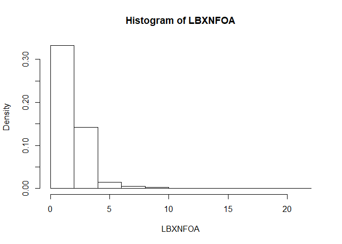
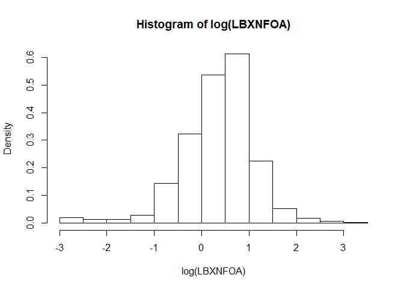
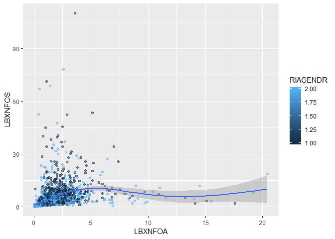
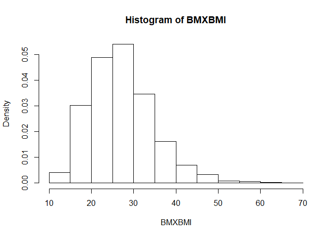
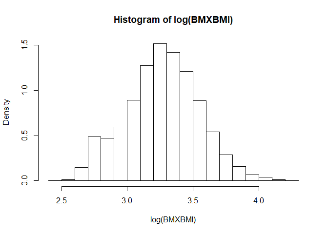

aamehs\_rnhanes
================
Stephen Lewandowski
February 5, 2019

RNHANES Exploration for AAMEHS
==============================

<https://cran.r-project.org/web/packages/RNHANES/vignettes/introduction.html> <https://www.r-bloggers.com/nhanes-made-simple-with-rnhanes/> <https://datascienceplus.com/weight-loss-in-the-u-s-an-analysis-of-nhanes-data-with-tidyverse/>

Install RNHANES package (first time - need development version for most recent cycles)

``` r
# library(devtools)
# install_github("silentspringinstitute/RNHANES")
```

``` r
library(tidyverse)
```

    ## Warning: package 'dplyr' was built under R version 3.5.2

``` r
library(RNHANES)
```

NHANES files and the comprehensive variable list

``` r
files <- nhanes_data_files()  #1,328 obs of 10 variables
variables <- nhanes_variables()  #slow, takes ~5 minutes (48,398 obs of 10 variables)
```

``` r
files %>% count(cycle) %>% View
files %>% count(component)
```

    ## # A tibble: 5 x 2
    ##   component         n
    ##   <chr>         <int>
    ## 1 demographics     16
    ## 2 dietary          90
    ## 3 examination     141
    ## 4 laboratory      643
    ## 5 questionnaire   438

Search files and variables
--------------------------

``` r
nhanes_search(files, "environmental phenols")
```

    ##       cycle            data_file_description     doc_file
    ## 1 2007-2008            Environmental Phenols    EPH_E Doc
    ## 2 2003-2004            Environmental Phenols L24EPH_C Doc
    ## 3 2009-2010            Environmental Phenols    EPH_F Doc
    ## 4 2005-2006 Environmental Phenols & Parabens    EPH_D Doc
    ## 5 2011-2012 Environmental Phenols & Parabens    EPH_G Doc
    ##                        data_file         date_published  component
    ## 1    EPH_E Data [XPT - 406.9 KB] Updated September 2011 laboratory
    ## 2 L24EPH_C Data [XPT - 185.6 KB]     Updated March 2013 laboratory
    ## 3    EPH_F Data [XPT - 421.9 KB]           October 2011 laboratory
    ## 4      EPH_D Data [XPT - 395 KB]            August 2009 laboratory
    ## 5    EPH_G Data [XPT - 347.6 KB]   Updated October 2014 laboratory
    ##   confidential data_file_name file_type data_file_size
    ## 1        FALSE          EPH_E       XPT       406.9 KB
    ## 2        FALSE       L24EPH_C       XPT       185.6 KB
    ## 3        FALSE          EPH_F       XPT       421.9 KB
    ## 4        FALSE          EPH_D       XPT         395 KB
    ## 5        FALSE          EPH_G       XPT       347.6 KB

``` r
nhanes_search(files, "pesticides", component == "laboratory", cycle == "2003-2004") 
```

    ##       cycle
    ## 1 2003-2004
    ## 2 2003-2004
    ## 3 2003-2004
    ##                                                                                   data_file_description
    ## 1 Pesticides - Current Use - Urine (Formerly Priority Pesticides, Non-persistent Pesticide Metabolites)
    ## 2                                                                    Pesticides - Environmental - Urine
    ## 3                                             Pesticides - Organochlorine Metabolites - Serum (Surplus)
    ##       doc_file                      data_file      date_published
    ## 1 L26UPP_C Doc   L26UPP_C Data [XPT - 1.2 MB] Updated August 2011
    ## 2  L24PP_C Doc  L24PP_C Data [XPT - 267.8 KB]          March 2010
    ## 3 L28OCP_C Doc L28OCP_C Data [XPT - 754.9 KB]          April 2008
    ##    component confidential data_file_name file_type data_file_size
    ## 1 laboratory        FALSE       L26UPP_C       XPT         1.2 MB
    ## 2 laboratory        FALSE        L24PP_C       XPT       267.8 KB
    ## 3 laboratory        FALSE       L28OCP_C       XPT       754.9 KB

``` r
nhanes_search(files, "", cycle == "2003-2004") %>% head
```

    ##        cycle                                  data_file_description
    ## 5  2003-2004                 Demographic Variables & Sample Weights
    ## 19 2003-2004        Dietary Interview - Individual Foods, First Day
    ## 26 2003-2004       Dietary Interview - Individual Foods, Second Day
    ## 35 2003-2004  Dietary Interview - Total Nutrient Intakes, First Day
    ## 42 2003-2004 Dietary Interview - Total Nutrient Intakes, Second Day
    ## 51 2003-2004  Dietary Interview Technical Support File - Food Codes
    ##        doc_file                     data_file         date_published
    ## 5    DEMO_C Doc    DEMO_C Data [XPT - 3.4 MB] Updated September 2009
    ## 19 DR1IFF_C Doc DR1IFF_C Data [XPT - 82.1 MB]  Updated November 2007
    ## 26 DR2IFF_C Doc DR2IFF_C Data [XPT - 75.6 MB]  Updated November 2007
    ## 35 DR1TOT_C Doc DR1TOT_C Data [XPT - 11.8 MB]  Updated November 2007
    ## 42 DR2TOT_C Doc    DR2TOT_C Data [XPT - 6 MB]  Updated November 2007
    ## 51 DRXFCD_C Doc  DRXFCD_C Data [XPT - 1.8 MB]  Updated November 2007
    ##       component confidential data_file_name file_type data_file_size
    ## 5  demographics        FALSE         DEMO_C       XPT         3.4 MB
    ## 19      dietary        FALSE       DR1IFF_C       XPT        82.1 MB
    ## 26      dietary        FALSE       DR2IFF_C       XPT        75.6 MB
    ## 35      dietary        FALSE       DR1TOT_C       XPT        11.8 MB
    ## 42      dietary        FALSE       DR2TOT_C       XPT           6 MB
    ## 51      dietary        FALSE       DRXFCD_C       XPT         1.8 MB

``` r
nhanes_search(variables, "triclosan") %>% head
```

    ##   variable_name
    ## 1      URDTRSLC
    ## 2        URXTRS
    ## 3      URDTRSLC
    ## 4        URXTRS
    ## 5        URDTRS
    ## 6      URDTRSLC
    ##                                                        variable_description
    ## 1 Urinary  2,4,4’-Trichloro-2’-hydroxyphenyl ether (Triclosan) comment code
    ## 2              Urinary  2,4,4’-Trichloro-2’-hydroxyphenyl ether (Triclosan)
    ## 3 Urinary  2,4,4'-Trichloro-2'-hydroxyphenyl ether (Triclosan) comment code
    ## 4              Urinary  2,4,4'-Trichloro-2'-hydroxyphenyl ether (Triclosan)
    ## 5              Urinary  2,4,4'-Trichloro-2'-hydroxyphenyl ether (Triclosan)
    ## 6 Urinary  2,4,4'-Trichloro-2'-hydroxyphenyl ether (Triclosan) comment code
    ##   data_file_name            data_file_description begin_year  component
    ## 1          EPH_E            Environmental Phenols       2007 laboratory
    ## 2          EPH_E            Environmental Phenols       2007 laboratory
    ## 3          EPH_D Environmental Phenols & Parabens       2005 laboratory
    ## 4          EPH_D Environmental Phenols & Parabens       2005 laboratory
    ## 5       L24EPH_C            Environmental Phenols       2003 laboratory
    ## 6       L24EPH_C            Environmental Phenols       2003 laboratory
    ##   use_constraints end_year     cycle      unit
    ## 1            None     2008 2007-2008 Triclosan
    ## 2            None     2008 2007-2008 Triclosan
    ## 3            None     2006 2005-2006 Triclosan
    ## 4            None     2006 2005-2006 Triclosan
    ## 5            None     2004 2003-2004 Triclosan
    ## 6            None     2004 2003-2004 Triclosan

``` r
nhanes_search(variables, "DDT", data_file_name == "LAB28POC") %>% head
```

    ##   variable_name    variable_description data_file_name
    ## 1      LBDODTLC   o,p'-DDT Comment code       LAB28POC
    ## 2      LBDPDTLC   p,p'-DDT Comment code       LAB28POC
    ## 3        LBXODT         o,p'-DDT (ng/g)       LAB28POC
    ## 4      LBXODTLA o,p'-DDT Lipid Adjusted       LAB28POC
    ## 5        LBXPDT         p,p'-DDT (ng/g)       LAB28POC
    ## 6      LBXPDTLA p,p'-DDT Lipid Adjusted       LAB28POC
    ##              data_file_description begin_year  component use_constraints
    ## 1 Dioxins, Furans, & Coplanar PCBs       1999 laboratory            None
    ## 2 Dioxins, Furans, & Coplanar PCBs       1999 laboratory            None
    ## 3 Dioxins, Furans, & Coplanar PCBs       1999 laboratory            None
    ## 4 Dioxins, Furans, & Coplanar PCBs       1999 laboratory            None
    ## 5 Dioxins, Furans, & Coplanar PCBs       1999 laboratory            None
    ## 6 Dioxins, Furans, & Coplanar PCBs       1999 laboratory            None
    ##   end_year     cycle unit
    ## 1     2000 1999-2000 <NA>
    ## 2     2000 1999-2000 <NA>
    ## 3     2000 1999-2000 ng/g
    ## 4     2000 1999-2000 <NA>
    ## 5     2000 1999-2000 ng/g
    ## 6     2000 1999-2000 <NA>

``` r
nhanes_search(variables, "", data_file_name == "EPH_E") %>% head
```

    ##       variable_name
    ## 22367          SEQN
    ## 22368      URD4TOLC
    ## 22369      URDBP3LC
    ## 22370      URDBPHLC
    ## 22371      URDBUPLC
    ## 22372      URDEPBLC
    ##                                                       variable_description
    ## 22367                                          Respondent sequence number.
    ## 22368                              Urinary 4-tert-octylphenol comment code
    ## 22369 Urinary 2-Hydroxy-4-metoxybenzophenone (Benzophenone-3) comment code
    ## 22370                                     Urinary Bisphenol A comment code
    ## 22371                                           Butyl paraben comment code
    ## 22372                                                Ethyl paraben comment
    ##       data_file_name data_file_description begin_year  component
    ## 22367          EPH_E Environmental Phenols       2007 laboratory
    ## 22368          EPH_E Environmental Phenols       2007 laboratory
    ## 22369          EPH_E Environmental Phenols       2007 laboratory
    ## 22370          EPH_E Environmental Phenols       2007 laboratory
    ## 22371          EPH_E Environmental Phenols       2007 laboratory
    ## 22372          EPH_E Environmental Phenols       2007 laboratory
    ##       use_constraints end_year     cycle           unit
    ## 22367            None     2008 2007-2008           <NA>
    ## 22368            None     2008 2007-2008           <NA>
    ## 22369            None     2008 2007-2008 Benzophenone-3
    ## 22370            None     2008 2007-2008           <NA>
    ## 22371            None     2008 2007-2008           <NA>
    ## 22372            None     2008 2007-2008           <NA>

Download data files
-------------------

specify the name and cycle year, Saves the files to a temporary directory by default. You can optionally set where you want the files to be downloaded.

``` r
nhanes_load_data("EPH", "2007-2008", cache = "./nhanes_data", demographics = TRUE, recode = TRUE)
```

Example of data loaded from multiple files/cycle years. Download all files that contain a "PFOS" variable.

``` r
?RNHANES::nhanes_search
results <- nhanes_search(variables, "PFOS")
results$cycle
pfos <- nhanes_load_data(results$data_file_name, results$cycle, demographics = TRUE, recode = TRUE) #slow; large list, 9 elements, 12 MB

pfos
```

Load and Inspect PFAS data
--------------------------

NHANES Codebook References: <https://wwwn.cdc.gov/Nchs/Nhanes/2013-2014/PFAS_H.htm> <https://wwwn.cdc.gov/Nchs/Nhanes/2015-2016/PFAS_I.htm>

``` r
pfas_data <- nhanes_load_data("PFAS_I", "2015-2016", demographics = TRUE)
```

    ## Downloading PFAS_I.XPT to C:\Users\jenni\AppData\Local\Temp\Rtmpw1qMri/PFAS_I.XPT

    ## Downloading DEMO_I.XPT to C:\Users\jenni\AppData\Local\Temp\Rtmpw1qMri/DEMO_I.XPT

    ## Caching CSV to C:\Users\jenni\AppData\Local\Temp\Rtmpw1qMri/DEMO_I.csv

``` r
as_tibble(pfas_data)
```

    ## # A tibble: 2,170 x 72
    ##     SEQN cycle SDDSRVYR RIDSTATR RIAGENDR RIDAGEYR RIDAGEMN RIDRETH1
    ##    <dbl> <chr>    <dbl>    <dbl>    <dbl>    <dbl>    <dbl>    <dbl>
    ##  1 83736 2015~        9        2        2       42       NA        4
    ##  2 83745 2015~        9        2        2       15       NA        3
    ##  3 83750 2015~        9        2        1       45       NA        5
    ##  4 83754 2015~        9        2        2       67       NA        2
    ##  5 83762 2015~        9        2        2       27       NA        4
    ##  6 83767 2015~        9        2        2       54       NA        5
    ##  7 83769 2015~        9        2        1       49       NA        5
    ##  8 83770 2015~        9        2        1       15       NA        4
    ##  9 83774 2015~        9        2        2       13       NA        3
    ## 10 83776 2015~        9        2        2       58       NA        1
    ## # ... with 2,160 more rows, and 64 more variables: RIDRETH3 <dbl>,
    ## #   RIDEXMON <dbl>, RIDEXAGM <dbl>, DMQMILIZ <dbl>, DMQADFC <dbl>,
    ## #   DMDBORN4 <dbl>, DMDCITZN <dbl>, DMDYRSUS <dbl>, DMDEDUC3 <dbl>,
    ## #   DMDEDUC2 <dbl>, DMDMARTL <dbl>, RIDEXPRG <dbl>, SIALANG <dbl>,
    ## #   SIAPROXY <dbl>, SIAINTRP <dbl>, FIALANG <dbl>, FIAPROXY <dbl>,
    ## #   FIAINTRP <dbl>, MIALANG <dbl>, MIAPROXY <dbl>, MIAINTRP <dbl>,
    ## #   AIALANGA <dbl>, DMDHHSIZ <dbl>, DMDFMSIZ <dbl>, DMDHHSZA <dbl>,
    ## #   DMDHHSZB <dbl>, DMDHHSZE <dbl>, DMDHRGND <dbl>, DMDHRAGE <dbl>,
    ## #   DMDHRBR4 <dbl>, DMDHREDU <dbl>, DMDHRMAR <dbl>, DMDHSEDU <dbl>,
    ## #   WTINT2YR <dbl>, WTMEC2YR <dbl>, SDMVPSU <dbl>, SDMVSTRA <dbl>,
    ## #   INDHHIN2 <dbl>, INDFMIN2 <dbl>, INDFMPIR <dbl>, WTSB2YR <dbl>,
    ## #   LBXPFDE <dbl>, LBDPFDEL <dbl>, LBXPFHS <dbl>, LBDPFHSL <dbl>,
    ## #   LBXMPAH <dbl>, LBDMPAHL <dbl>, LBXPFNA <dbl>, LBDPFNAL <dbl>,
    ## #   LBXPFUA <dbl>, LBDPFUAL <dbl>, LBXPFDO <dbl>, LBDPFDOL <dbl>,
    ## #   LBXNFOA <dbl>, LBDNFOAL <dbl>, LBXBFOA <dbl>, LBDBFOAL <dbl>,
    ## #   LBXNFOS <dbl>, LBDNFOSL <dbl>, LBXMFOS <dbl>, LBDMFOSL <dbl>,
    ## #   file_name <chr>, begin_year <dbl>, end_year <dbl>

Inspect PFAS data from 2015-2016

``` r
pfas_data %>%  nhanes_detection_frequency("LBXNFOA", "LBDNFOAL")
```

    ## Weights column wasn't specified -- using WTSB2YR for weights

    ##       value     cycle begin_year end_year file_name  column weights_column
    ## 1 0.9894482 2015-2016       2015     2016    PFAS_I LBXNFOA        WTSB2YR
    ##   comment_column                name
    ## 1       LBDNFOAL detection_frequency

``` r
pfas_data %>% nhanes_sample_size("LBXNFOA","LBDNFOAL")
```

    ## Weights column wasn't specified -- using WTSB2YR for weights

    ##   value     cycle begin_year end_year file_name  column weights_column
    ## 1  1993 2015-2016       2015     2016    PFAS_I LBXNFOA        WTSB2YR
    ##   comment_column        name
    ## 1       LBDNFOAL sample size

``` r
pfas_data %>%  nhanes_quantile("LBXNFOA", "LBDNFOAL", quantiles = c(0.5, 0.95))
```

    ## Weights column wasn't specified -- using WTSB2YR for weights

    ## Warning in callback(nhanes_data, ret): No detection limit found from the
    ## summary tables. Falling back to inferring detection limit from the fill
    ## value.

    ##   value     cycle begin_year end_year file_name  column weights_column
    ## 1   1.5 2015-2016       2015     2016    PFAS_I LBXNFOA        WTSB2YR
    ## 2   4.1 2015-2016       2015     2016    PFAS_I LBXNFOA        WTSB2YR
    ##   comment_column below_lod quantile     name
    ## 1       LBDNFOAL     FALSE      50% quantile
    ## 2       LBDNFOAL     FALSE      95% quantile

Histogram, log transformed

``` r
pfas_data %>%  nhanes_hist("LBXNFOA", "LBDNFOAL")
```

    ## Weights column wasn't specified -- using WTSB2YR for weights



``` r
pfas_data %>%  nhanes_hist("LBXNFOA", "LBDNFOAL", transform = "log")
```

    ## Weights column wasn't specified -- using WTSB2YR for weights



``` r
pfas_data %>% 
  ggplot(aes(x = LBXNFOA, y = LBXNFOS)) + 
  geom_point(aes(color = RIAGENDR), alpha = .5) +
  geom_smooth(se = TRUE)
```

    ## Warning: Removed 177 rows containing non-finite values (stat_smooth).

    ## Warning: Removed 177 rows containing missing values (geom_point).



``` r
pfas_data %>% 
  ggplot(aes(x = RIDAGEYR, y = LBXNFOS)) + 
  geom_point(aes(color = RIAGENDR), alpha = .5) +
  geom_smooth(se = TRUE)
```

    ## Warning: Removed 177 rows containing non-finite values (stat_smooth).

    ## Warning: Removed 177 rows containing missing values (geom_point).


Load and Inspect BMI data
-------------------------

NHANES Codebook References: <https://wwwn.cdc.gov/Nchs/Nhanes/2015-2016/BMX_I.htm>

``` r
bodymass_data <- nhanes_load_data("BMX_I", "2015-2016", demographics = TRUE)
```

    ## Downloading BMX_I.XPT to C:\Users\jenni\AppData\Local\Temp\Rtmpw1qMri/BMX_I.XPT

``` r
as_tibble(bodymass_data)
```

    ## # A tibble: 9,544 x 76
    ##     SEQN cycle SDDSRVYR RIDSTATR RIAGENDR RIDAGEYR RIDAGEMN RIDRETH1
    ##    <int> <chr>    <int>    <int>    <int>    <int>    <int>    <int>
    ##  1 83732 2015~        9        2        1       62       NA        3
    ##  2 83733 2015~        9        2        1       53       NA        3
    ##  3 83734 2015~        9        2        1       78       NA        3
    ##  4 83735 2015~        9        2        2       56       NA        3
    ##  5 83736 2015~        9        2        2       42       NA        4
    ##  6 83737 2015~        9        2        2       72       NA        1
    ##  7 83738 2015~        9        2        2       11       NA        1
    ##  8 83739 2015~        9        2        1        4       NA        3
    ##  9 83740 2015~        9        2        1        1       13        2
    ## 10 83741 2015~        9        2        1       22       NA        4
    ## # ... with 9,534 more rows, and 68 more variables: RIDRETH3 <int>,
    ## #   RIDEXMON <int>, RIDEXAGM <int>, DMQMILIZ <int>, DMQADFC <int>,
    ## #   DMDBORN4 <int>, DMDCITZN <int>, DMDYRSUS <int>, DMDEDUC3 <int>,
    ## #   DMDEDUC2 <int>, DMDMARTL <int>, RIDEXPRG <int>, SIALANG <int>,
    ## #   SIAPROXY <int>, SIAINTRP <int>, FIALANG <int>, FIAPROXY <int>,
    ## #   FIAINTRP <int>, MIALANG <int>, MIAPROXY <int>, MIAINTRP <int>,
    ## #   AIALANGA <int>, DMDHHSIZ <int>, DMDFMSIZ <int>, DMDHHSZA <int>,
    ## #   DMDHHSZB <int>, DMDHHSZE <int>, DMDHRGND <int>, DMDHRAGE <int>,
    ## #   DMDHRBR4 <int>, DMDHREDU <int>, DMDHRMAR <int>, DMDHSEDU <int>,
    ## #   WTINT2YR <dbl>, WTMEC2YR <dbl>, SDMVPSU <int>, SDMVSTRA <int>,
    ## #   INDHHIN2 <int>, INDFMIN2 <int>, INDFMPIR <dbl>, BMDSTATS <dbl>,
    ## #   BMXWT <dbl>, BMIWT <dbl>, BMXRECUM <dbl>, BMIRECUM <dbl>,
    ## #   BMXHEAD <dbl>, BMIHEAD <dbl>, BMXHT <dbl>, BMIHT <dbl>, BMXBMI <dbl>,
    ## #   BMDBMIC <dbl>, BMXLEG <dbl>, BMILEG <dbl>, BMXARML <dbl>,
    ## #   BMIARML <dbl>, BMXARMC <dbl>, BMIARMC <dbl>, BMXWAIST <dbl>,
    ## #   BMIWAIST <dbl>, BMXSAD1 <dbl>, BMXSAD2 <dbl>, BMXSAD3 <dbl>,
    ## #   BMXSAD4 <dbl>, BMDAVSAD <dbl>, BMDSADCM <dbl>, file_name <chr>,
    ## #   begin_year <dbl>, end_year <dbl>

Inspect body mass data from 2015-2016

``` r
bodymass_data %>%  nhanes_detection_frequency("BMXBMI", "BMXBMI", "WTMEC2YR") # not completely sure on weight
```

    ##       value     cycle begin_year end_year file_name column weights_column
    ## 1 -26.28165 2015-2016       2015     2016     BMX_I BMXBMI       WTMEC2YR
    ##   comment_column                name
    ## 1         BMXBMI detection_frequency

``` r
bodymass_data %>% nhanes_sample_size("BMXBMI", "BMXBMI", "WTMEC2YR")
```

    ##   value     cycle begin_year end_year file_name column weights_column
    ## 1  8756 2015-2016       2015     2016     BMX_I BMXBMI       WTMEC2YR
    ##   comment_column        name
    ## 1         BMXBMI sample size

``` r
bodymass_data %>%  nhanes_quantile("BMXBMI","BMXBMI", "WTMEC2YR", quantiles = c(0.5, 0.95))
```

    ## Warning in callback(nhanes_data, ret): No detection limit found from the
    ## summary tables. Falling back to inferring detection limit from the fill
    ## value.

    ## Warning in callback(nhanes_data, ret): Multiple detection limits were
    ## found. Falling back to computing detection frequency to infer if a quantile
    ## is below the limit of detection.

    ##   value     cycle begin_year end_year file_name column weights_column
    ## 1  26.6 2015-2016       2015     2016     BMX_I BMXBMI       WTMEC2YR
    ## 2  41.3 2015-2016       2015     2016     BMX_I BMXBMI       WTMEC2YR
    ##   comment_column below_lod quantile     name
    ## 1         BMXBMI     FALSE      50% quantile
    ## 2         BMXBMI     FALSE      95% quantile

Histogram, log transformed

``` r
bodymass_data %>%  nhanes_hist("BMXBMI", "BMXBMI", "WTMEC2YR")
```



``` r
bodymass_data %>%  nhanes_hist("BMXBMI", "BMXBMI", "WTMEC2YR", transform = "log")
```



``` r
bodymass_data %>% 
  ggplot(aes(x = RIDAGEYR, y = BMXBMI)) + 
  geom_point(aes(color = RIAGENDR), alpha = .5) +
  geom_smooth(se = TRUE)
```

    ## Warning: Removed 788 rows containing non-finite values (stat_smooth).

    ## Warning: Removed 788 rows containing missing values (geom_point).


