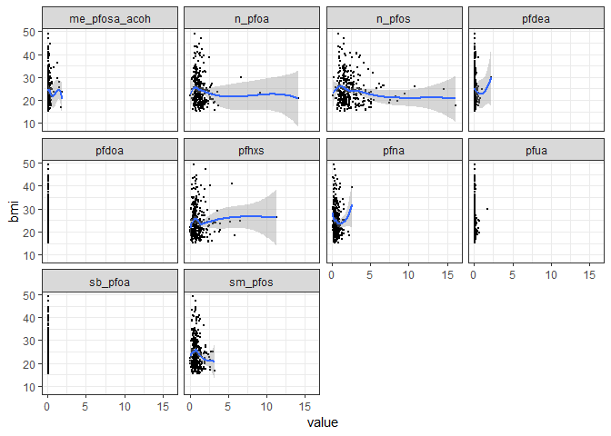
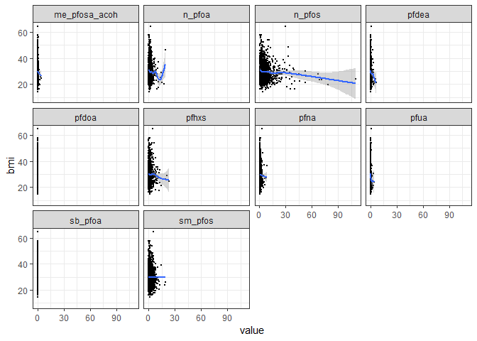
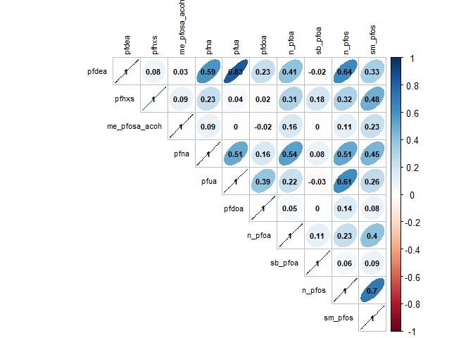
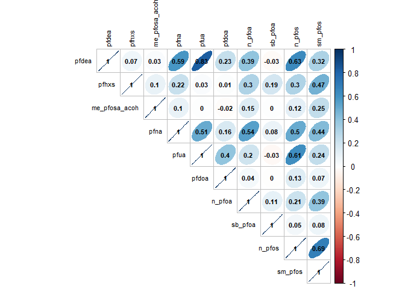
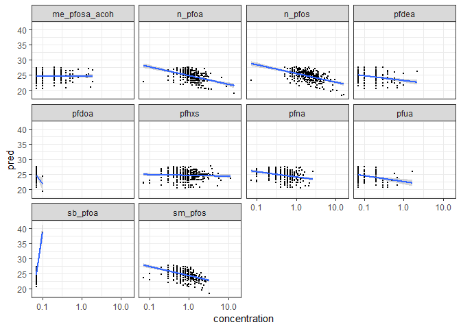
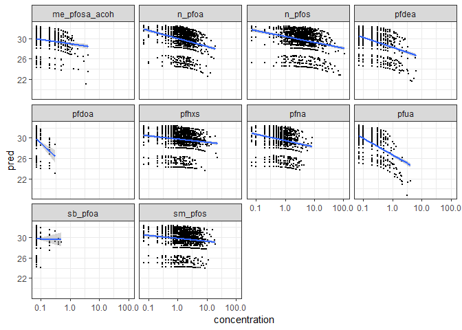
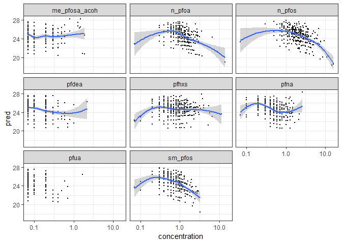
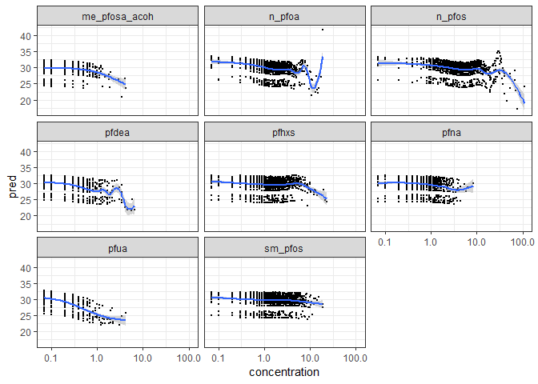
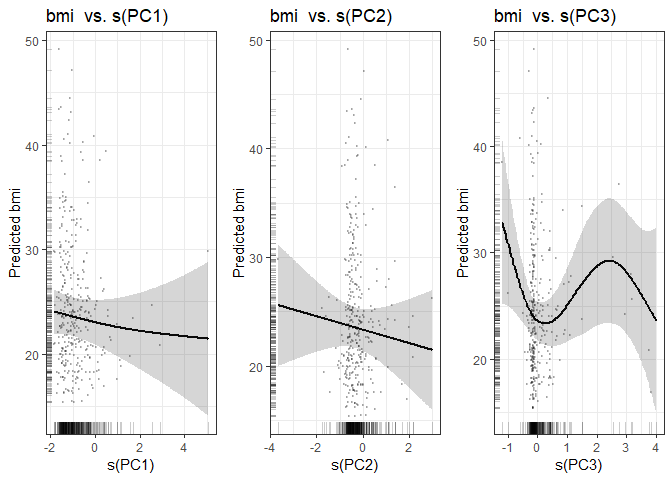
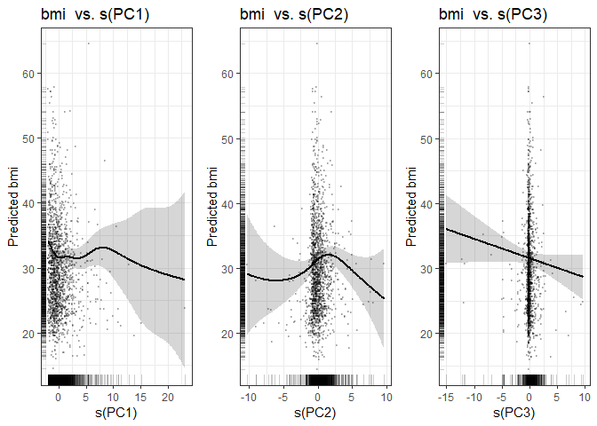

nonlinear\_age
================
SL
April 17, 2019

-   [Data Summary](#data-summary)
-   [Plots](#plots)
-   [Correlations](#correlations)
-   [Linear](#linear)
    -   [PFAS beta coefficient estimate and model summary statistics](#pfas-beta-coefficient-estimate-and-model-summary-statistics)
    -   [Linear predicted values plots](#linear-predicted-values-plots)
-   [Penalized spline GAMs](#penalized-spline-gams)
-   [PCA Model](#pca-model)

Load dataset from pipeline output

Data Summary
------------

Plots
-----

    ## `geom_smooth()` using method = 'loess' and formula 'y ~ x'

    ## `geom_smooth()` using method = 'gam' and formula 'y ~ s(x, bs = "cs")'

Correlations
------------

Linear
------

### PFAS beta coefficient estimate and model summary statistics

| chemical        |  estimate|  std.error|  p.value.x|  adj.r.squared|  statistic|     logLik|       AIC|       BIC|
|:----------------|---------:|----------:|----------:|--------------:|----------:|----------:|---------:|---------:|
| pfdea           |     0.185|      2.084|      0.929|          0.025|      1.786|  -1075.646|  2177.293|  2226.798|
| pfhxs           |     0.123|      0.356|      0.729|          0.026|      1.797|  -1075.588|  2177.176|  2226.682|
| me\_pfosa\_acoh |     0.309|      1.411|      0.827|          0.025|      1.790|  -1075.625|  2177.251|  2226.757|
| pfna            |    -0.194|      1.008|      0.848|          0.025|      1.789|  -1075.631|  2177.263|  2226.768|
| pfua            |     0.003|      3.052|      0.999|          0.025|      1.785|  -1075.650|  2177.301|  2226.807|
| pfdoa           |  -103.686|    148.447|      0.485|          0.027|      1.832|  -1075.398|  2176.795|  2226.301|
| n\_pfoa         |    -0.288|      0.345|      0.404|          0.027|      1.852|  -1075.288|  2176.577|  2226.083|
| sb\_pfoa        |   456.815|    208.332|      0.029|          0.040|      2.249|  -1073.175|  2172.350|  2221.856|
| n\_pfos         |    -0.302|      0.201|      0.135|          0.032|      2.001|  -1074.491|  2174.983|  2224.488|
| sm\_pfos        |    -1.054|      0.740|      0.155|          0.031|      1.981|  -1074.601|  2175.203|  2224.709|

| chemical        |  estimate|  std.error|  p.value.x|  adj.r.squared|  statistic|     logLik|       AIC|       BIC|
|:----------------|---------:|----------:|----------:|--------------:|----------:|----------:|---------:|---------:|
| pfdea           |    -0.849|      0.379|      0.025|          0.078|     13.041|  -5206.416|  10438.83|  10508.52|
| pfhxs           |    -0.088|      0.094|      0.348|          0.075|     12.630|  -5208.505|  10443.01|  10512.70|
| me\_pfosa\_acoh |    -1.300|      0.607|      0.032|          0.077|     12.996|  -5206.642|  10439.28|  10508.97|
| pfna            |    -0.254|      0.242|      0.294|          0.075|     12.652|  -5208.393|  10442.79|  10512.48|
| pfua            |    -2.340|      0.665|      0.000|          0.082|     13.770|  -5202.726|  10431.45|  10501.14|
| pfdoa           |    -8.539|     11.435|      0.455|          0.075|     12.598|  -5208.667|  10443.33|  10513.02|
| n\_pfoa         |    -0.198|      0.103|      0.055|          0.077|     12.907|  -5207.094|  10440.19|  10509.88|
| sb\_pfoa        |    -3.385|      7.518|      0.653|          0.075|     12.563|  -5208.846|  10443.69|  10513.38|
| n\_pfos         |    -0.040|      0.024|      0.096|          0.076|     12.818|  -5207.548|  10441.10|  10510.78|
| sm\_pfos        |    -0.035|      0.090|      0.694|          0.075|     12.558|  -5208.870|  10443.74|  10513.43|

### Linear predicted values plots

Penalized spline GAMs
---------------------

k = 9 knots (limited by adolescent model)

GAM penalized spline PFAS estimated degrees of freedom and model summary statistics

| chemical        |    edf|  ref.df|  statistic|  p.value|     logLik|       AIC|       BIC|
|:----------------|------:|-------:|----------:|--------:|----------:|---------:|---------:|
| pfdea           |  1.000|   1.000|      0.008|    0.929|  -1075.646|  2177.293|  2226.798|
| pfhxs           |  1.000|   1.000|      0.120|    0.729|  -1075.588|  2177.176|  2226.682|
| me\_pfosa\_acoh |  2.774|   3.387|      0.663|    0.586|  -1073.809|  2177.166|  2233.427|
| pfna            |  1.580|   1.975|      0.424|    0.637|  -1074.800|  2176.760|  2228.473|
| pfua            |  1.136|   1.257|      0.035|    0.906|  -1075.498|  2177.268|  2227.292|
| n\_pfoa         |  1.000|   1.000|      0.699|    0.404|  -1075.288|  2176.577|  2226.083|
| n\_pfos         |  1.000|   1.000|      2.242|    0.135|  -1074.491|  2174.983|  2224.488|
| sm\_pfos        |  1.000|   1.000|      2.029|    0.155|  -1074.601|  2175.203|  2224.709|

| chemical        |    edf|  ref.df|  statistic|  p.value|     logLik|       AIC|       BIC|
|:----------------|------:|-------:|----------:|--------:|----------:|---------:|---------:|
| pfdea           |  2.825|   3.469|      1.937|    0.094|  -1075.646|  2177.293|  2226.798|
| pfhxs           |  3.614|   4.416|      1.167|    0.366|  -1075.588|  2177.176|  2226.682|
| me\_pfosa\_acoh |  1.000|   1.000|      4.583|    0.032|  -1073.809|  2177.166|  2233.427|
| pfna            |  1.000|   1.000|      1.103|    0.294|  -1074.800|  2176.760|  2228.473|
| pfua            |  2.776|   3.416|      5.192|    0.001|  -1075.498|  2177.268|  2227.292|
| n\_pfoa         |  7.272|   7.796|      1.931|    0.073|  -1075.288|  2176.577|  2226.083|
| n\_pfos         |  7.671|   7.959|      2.421|    0.026|  -1074.491|  2174.983|  2224.488|
| sm\_pfos        |  1.398|   1.704|      0.185|    0.725|  -1074.601|  2175.203|  2224.709|

Penalized spline predicted values plots

    ## `geom_smooth()` using method = 'loess' and formula 'y ~ x'

    ## `geom_smooth()` using method = 'gam' and formula 'y ~ s(x, bs = "cs")'

PCA Model
---------

| term   |    edf|  ref.df|  p.value|
|:-------|------:|-------:|--------:|
| s(PC1) |  1.161|   1.306|    0.436|
| s(PC2) |  1.000|   1.000|    0.440|
| s(PC3) |  3.799|   4.774|    0.101|

| term   |    edf|  ref.df|  p.value|
|:-------|------:|-------:|--------:|
| s(PC1) |  5.664|   6.820|    0.039|
| s(PC2) |  3.858|   4.932|    0.022|
| s(PC3) |  1.000|   1.000|    0.088|

|     df|     logLik|       AIC|       BIC|  deviance|  df.residual|
|------:|----------:|---------:|---------:|---------:|------------:|
|  16.96|  -1069.131|  2174.183|  2242.578|  11985.74|       316.04|

|      df|    logLik|       AIC|       BIC|  deviance|  df.residual|
|-------:|---------:|---------:|---------:|---------:|------------:|
|  21.523|  -5192.67|  10430.39|  10551.12|  67853.99|     1551.477|

Plot of PCA penalized splines with observed BMI points 
