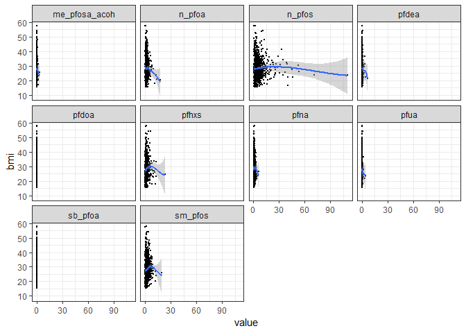
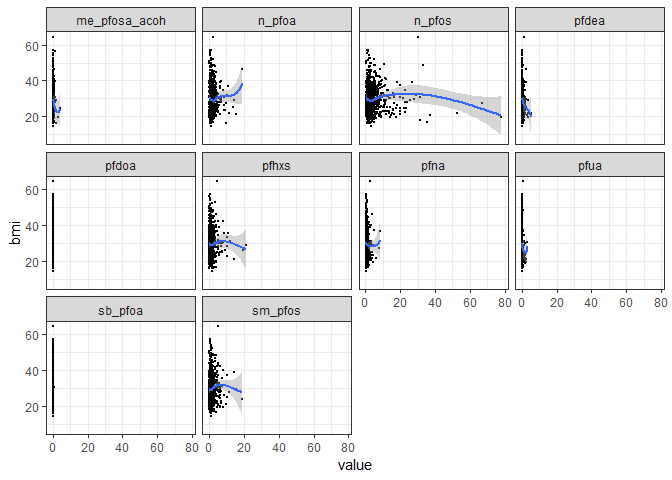
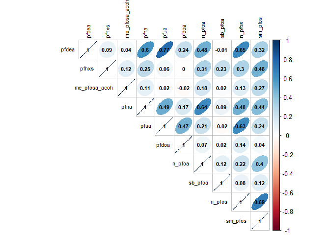
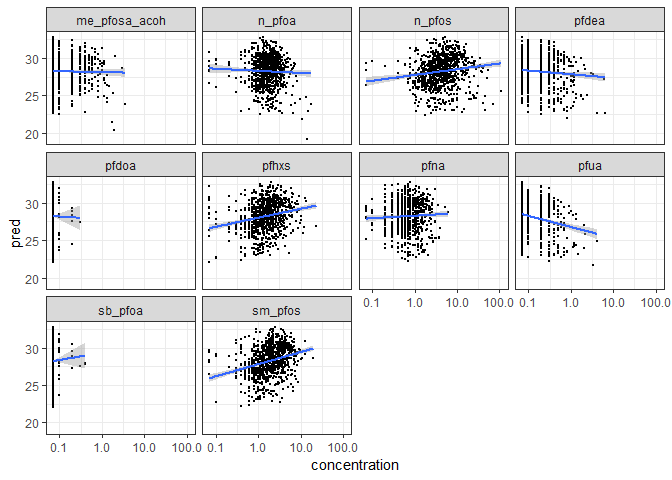
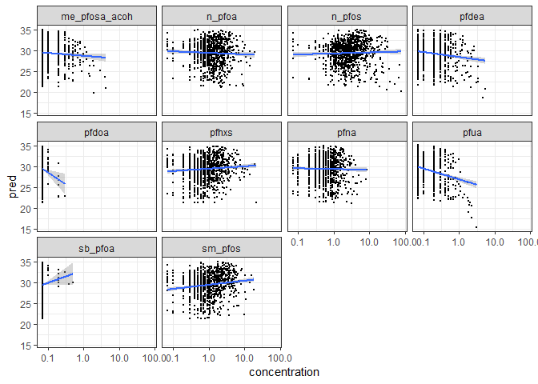
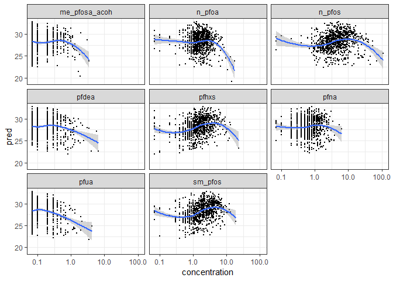
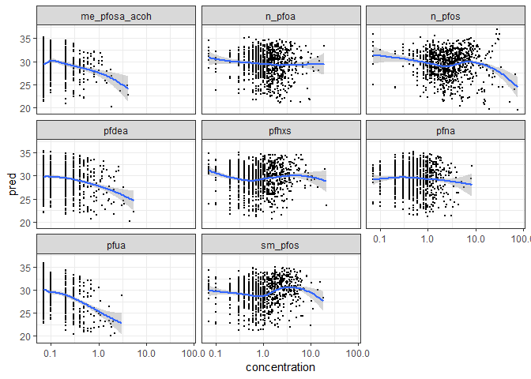
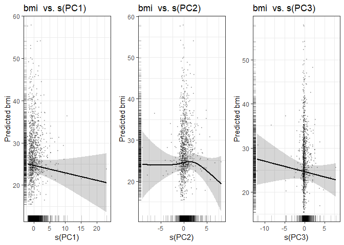
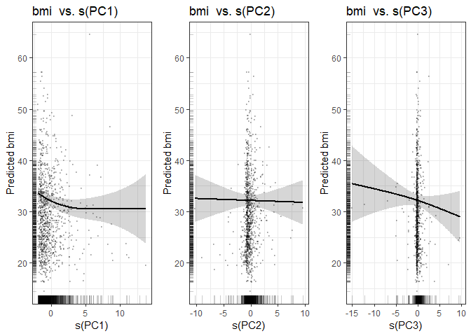

nonlinear\_gender
================
SL
April 17, 2019

-   [Data Summary](#data-summary)
-   [Plots](#plots)
-   [Correlations](#correlations)
-   [Linear](#linear)
    -   [PFAS beta coefficient estimate and model summary statistics](#pfas-beta-coefficient-estimate-and-model-summary-statistics)
    -   [Linear predicted values plots](#linear-predicted-values-plots)
-   [Penalized spline GAMs](#penalized-spline-gams)
-   [PCA Model](#pca-model)

Load dataset from pipeline output

Data Summary
------------

Plots
-----

    ## `geom_smooth()` using method = 'loess' and formula 'y ~ x'

    ## `geom_smooth()` using method = 'loess' and formula 'y ~ x'

Correlations
------------

Linear
------

### PFAS beta coefficient estimate and model summary statistics

| chemical        |  estimate|  std.error|  p.value.x|  adj.r.squared|  statistic|     logLik|       AIC|       BIC|
|:----------------|---------:|----------:|----------:|--------------:|----------:|----------:|---------:|---------:|
| pfdea           |    -0.589|      0.511|      0.249|          0.078|      8.124|  -3046.543|  6119.086|  6181.985|
| pfhxs           |    -0.018|      0.122|      0.881|          0.076|      7.994|  -3047.205|  6120.410|  6183.309|
| me\_pfosa\_acoh |    -1.035|      0.793|      0.192|          0.078|      8.161|  -3046.355|  6118.710|  6181.609|
| pfna            |    -0.242|      0.363|      0.506|          0.077|      8.036|  -3046.992|  6119.983|  6182.882|
| pfua            |    -1.397|      0.841|      0.097|          0.079|      8.266|  -3045.821|  6117.642|  6180.542|
| pfdoa           |    -5.106|     15.091|      0.735|          0.076|      8.003|  -3047.158|  6120.316|  6183.216|
| n\_pfoa         |    -0.247|      0.147|      0.094|          0.079|      8.272|  -3045.794|  6117.588|  6180.487|
| sb\_pfoa        |    -7.083|     10.785|      0.512|          0.077|      8.035|  -3046.998|  6119.996|  6182.895|
| n\_pfos         |    -0.050|      0.031|      0.108|          0.079|      8.249|  -3045.908|  6117.815|  6180.714|
| sm\_pfos        |    -0.139|      0.128|      0.276|          0.077|      8.110|  -3046.615|  6119.231|  6182.130|

| chemical        |  estimate|  std.error|  p.value.x|  adj.r.squared|  statistic|     logLik|       AIC|       BIC|
|:----------------|---------:|----------:|----------:|--------------:|----------:|----------:|---------:|---------:|
| pfdea           |    -0.912|      0.552|      0.099|          0.131|     14.308|  -3258.296|  6542.593|  6606.038|
| pfhxs           |    -0.207|      0.141|      0.144|          0.130|     14.246|  -3258.596|  6543.192|  6606.637|
| me\_pfosa\_acoh |    -2.001|      0.806|      0.013|          0.134|     14.671|  -3256.565|  6539.131|  6602.576|
| pfna            |    -0.570|      0.331|      0.085|          0.131|     14.334|  -3258.174|  6542.348|  6605.793|
| pfua            |    -2.681|      1.018|      0.009|          0.135|     14.751|  -3256.183|  6538.366|  6601.811|
| pfdoa           |     1.542|     17.368|      0.929|          0.128|     14.021|  -3259.674|  6545.348|  6608.793|
| n\_pfoa         |    -0.205|      0.140|      0.145|          0.130|     14.245|  -3258.601|  6543.202|  6606.647|
| sb\_pfoa        |    -4.112|     10.523|      0.696|          0.129|     14.036|  -3259.601|  6545.201|  6608.646|
| n\_pfos         |    -0.074|      0.040|      0.064|          0.132|     14.382|  -3257.945|  6541.889|  6605.334|
| sm\_pfos        |    -0.177|      0.154|      0.248|          0.130|     14.161|  -3259.003|  6544.005|  6607.450|

### Linear predicted values plots

Penalized spline GAMs
---------------------

GAM penalized spline PFAS estimated degrees of freedom and model summary statistics

| chemical        |    edf|  ref.df|  statistic|  p.value|     logLik|       AIC|       BIC|
|:----------------|------:|-------:|----------:|--------:|----------:|---------:|---------:|
| pfdea           |  1.000|   1.000|      1.330|    0.249|  -3046.543|  6119.086|  6181.985|
| pfhxs           |  1.996|   2.533|      1.001|    0.500|  -3045.594|  6119.179|  6186.895|
| me\_pfosa\_acoh |  1.000|   1.000|      1.702|    0.192|  -3046.355|  6118.710|  6181.609|
| pfna            |  1.311|   1.565|      0.229|    0.627|  -3046.623|  6119.869|  6184.273|
| pfua            |  1.000|   1.000|      2.758|    0.097|  -3045.821|  6117.642|  6180.542|
| n\_pfoa         |  1.000|   1.000|      2.812|    0.094|  -3045.794|  6117.588|  6180.487|
| n\_pfos         |  1.000|   1.000|      2.587|    0.108|  -3045.908|  6117.815|  6180.714|
| sm\_pfos        |  1.664|   2.110|      0.989|    0.360|  -3045.692|  6118.713|  6184.824|

| chemical        |    edf|  ref.df|  statistic|  p.value|     logLik|       AIC|       BIC|
|:----------------|------:|-------:|----------:|--------:|----------:|---------:|---------:|
| pfdea           |  2.658|   3.307|      1.589|    0.163|  -3046.543|  6119.086|  6181.985|
| pfhxs           |  3.866|   4.715|      1.207|    0.327|  -3045.594|  6119.179|  6186.895|
| me\_pfosa\_acoh |  3.560|   4.320|      2.155|    0.075|  -3046.355|  6118.710|  6181.609|
| pfna            |  1.866|   2.343|      2.059|    0.136|  -3046.623|  6119.869|  6184.273|
| pfua            |  4.187|   5.042|      3.933|    0.002|  -3045.821|  6117.642|  6180.542|
| n\_pfoa         |  1.851|   2.332|      1.525|    0.201|  -3045.794|  6117.588|  6180.487|
| n\_pfos         |  6.804|   7.898|      1.953|    0.054|  -3045.908|  6117.815|  6180.714|
| sm\_pfos        |  1.000|   1.000|      1.335|    0.248|  -3045.692|  6118.713|  6184.824|

Penalized spline predicted values plots

    ## `geom_smooth()` using method = 'loess' and formula 'y ~ x'

    ## `geom_smooth()` using method = 'loess' and formula 'y ~ x'

PCA Model
---------

| term   |    edf|  ref.df|  p.value|
|:-------|------:|-------:|--------:|
| s(PC1) |  1.000|    1.00|    0.248|
| s(PC2) |  2.558|    3.37|    0.354|
| s(PC3) |  1.000|    1.00|    0.301|

| term   |    edf|  ref.df|  p.value|
|:-------|------:|-------:|--------:|
| s(PC1) |  2.214|   2.821|    0.024|
| s(PC2) |  1.000|   1.000|    0.863|
| s(PC3) |  1.197|   1.372|    0.291|

|      df|     logLik|       AIC|       BIC|  deviance|  df.residual|
|-------:|----------:|---------:|---------:|---------:|------------:|
|  15.558|  -3042.831|  6118.778|  6198.892|  37168.22|      917.442|

|     df|     logLik|       AIC|       BIC|  deviance|  df.residual|
|------:|----------:|---------:|---------:|---------:|------------:|
|  15.41|  -3252.954|  6538.729|  6618.817|   45658.7|       957.59|

Plot of PCA penalized splines with observed BMI points 
