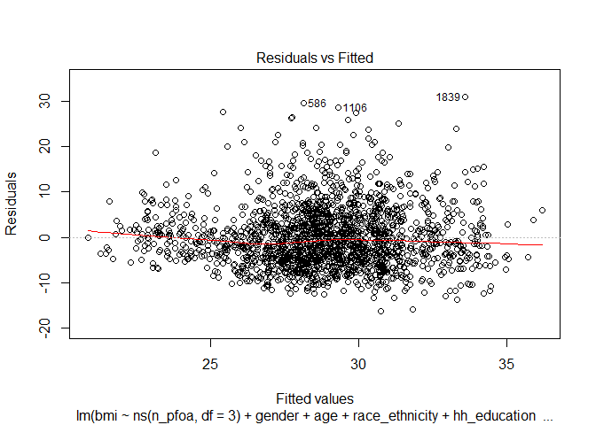
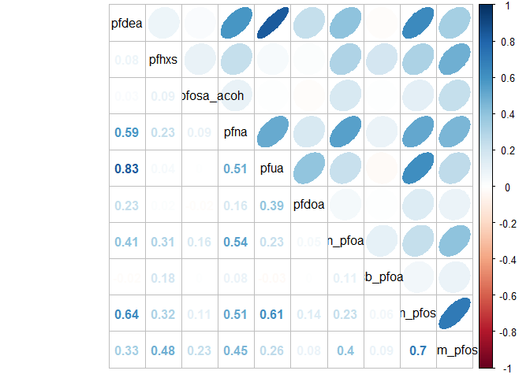
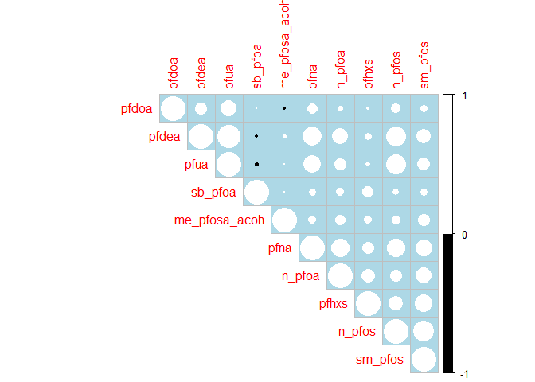
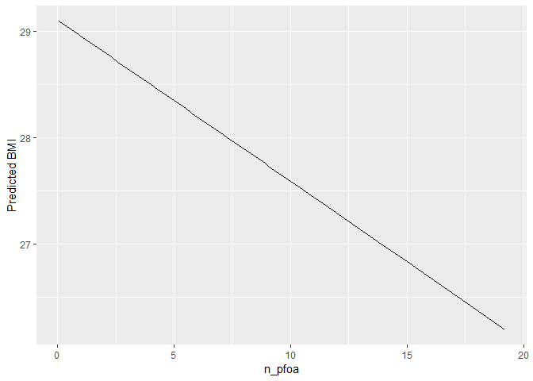
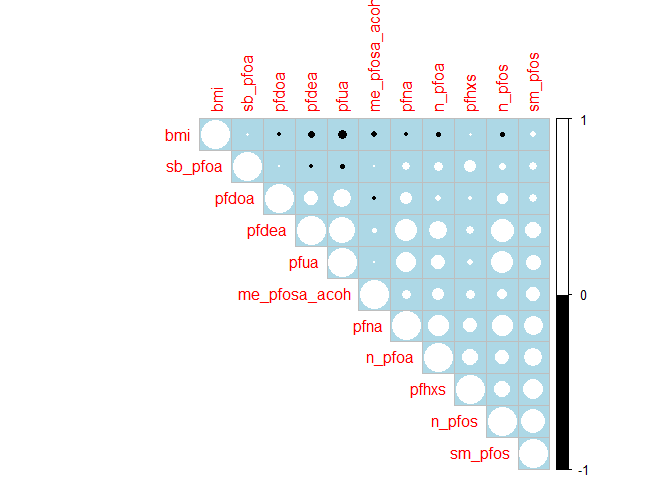

rnhanes\_nonlinear
================
SL
March 22, 2019

-   [Linear](#linear)
    -   [Linear, no additional variables](#linear-no-additional-variables)
    -   [Linear, simple model](#linear-simple-model)
-   [Natural Spline Term](#natural-spline-term)
    -   [glm natural spline](#glm-natural-spline)
    -   [gam natural spline](#gam-natural-spline)
-   [Penalized spline](#penalized-spline)

Load dataset from pipeline output

``` r
pfas <- read.csv("aamehs_data.csv") %>% 
   select(seqn, riagendr, ridageyr, ridreth3, indfmpir, pfdea, pfhxs, me_pfosa_acoh, pfna, pfua, pfdoa, n_pfoa, sb_pfoa, n_pfos, sm_pfos, bmxbmi) %>% 
  mutate(riagendr = factor(riagendr),
         ridreth3 = factor(ridreth3)) %>% 
  drop_na(bmxbmi)

glimpse(pfas)
```

    ## Observations: 1,977
    ## Variables: 16
    ## $ seqn          <int> 83736, 83745, 83750, 83754, 83762, 83767, 83769,...
    ## $ riagendr      <fct> 2, 2, 1, 2, 2, 2, 1, 1, 2, 2, 1, 2, 1, 2, 1, 2, ...
    ## $ ridageyr      <int> 42, 15, 45, 67, 27, 54, 49, 15, 13, 58, 16, 27, ...
    ## $ ridreth3      <fct> 4, 3, 7, 2, 4, 6, 6, 4, 3, 1, 2, 4, 3, 3, 3, 3, ...
    ## $ indfmpir      <dbl> 1.23, 0.86, 1.36, 0.89, 2.12, 2.99, 2.97, 0.66, ...
    ## $ pfdea         <dbl> 0.10, 0.07, 0.07, 0.10, 0.07, 0.40, 0.50, 0.20, ...
    ## $ pfhxs         <dbl> 0.6, 1.4, 4.9, 1.2, 0.2, 0.5, 2.5, 0.4, 0.8, 3.5...
    ## $ me_pfosa_acoh <dbl> 0.07, 0.07, 0.10, 0.10, 0.20, 0.07, 0.07, 0.07, ...
    ## $ pfna          <dbl> 0.5, 1.4, 0.8, 1.0, 0.4, 2.1, 1.5, 0.4, 0.3, 1.5...
    ## $ pfua          <dbl> 0.20, 0.07, 0.07, 0.07, 0.07, 0.30, 0.30, 0.10, ...
    ## $ pfdoa         <dbl> 0.07, 0.07, 0.07, 0.07, 0.07, 0.07, 0.07, 0.07, ...
    ## $ n_pfoa        <dbl> 0.9, 1.4, 1.2, 2.8, 0.5, 1.7, 2.3, 0.5, 1.2, 2.9...
    ## $ sb_pfoa       <dbl> 0.07, 0.07, 0.07, 0.07, 0.07, 0.07, 0.07, 0.07, ...
    ## $ n_pfos        <dbl> 3.8, 1.6, 4.1, 6.1, 0.9, 7.0, 10.0, 1.7, 1.4, 9....
    ## $ sm_pfos       <dbl> 0.6, 0.8, 1.9, 5.4, 0.4, 1.0, 3.9, 0.3, 0.7, 4.7...
    ## $ bmxbmi        <dbl> 20.3, 25.0, 24.1, 43.7, 38.0, 26.3, 25.0, 18.3, ...

``` r
#check for missing values
pfas %>% 
  select_if(function(x) any(is.na(x))) %>% 
  summarise_each(funs(sum(is.na(.)))) 
```

    ## Warning: funs() is soft deprecated as of dplyr 0.8.0
    ## please use list() instead
    ## 
    ## # Before:
    ## funs(name = f(.)
    ## 
    ## # After: 
    ## list(name = ~f(.))
    ## This warning is displayed once per session.

    ##   indfmpir
    ## 1      198

Missing values: indfmpir = 201 -- too high!, HH education level instead? bmxbmi = 16

RIAGENDR - Gender RIDAGEYR - Age in years at screening RIDRETH3 - Race/Hispanic origin w/ NH Asian DMQMILIZ - Served active duty in US Armed Forces

Linear
------

Need an SES term --- finding negative association??? -- stratify by gender

### Linear, no additional variables

``` r
pfoa_linear_single <- lm(bmxbmi ~ n_pfoa, data = pfas)

summary(pfoa_linear_single)
```

    ## 
    ## Call:
    ## lm(formula = bmxbmi ~ n_pfoa, data = pfas)
    ## 
    ## Residuals:
    ##     Min      1Q  Median      3Q     Max 
    ## -14.494  -5.114  -1.013   3.865  35.704 
    ## 
    ## Coefficients:
    ##             Estimate Std. Error t value Pr(>|t|)    
    ## (Intercept) 29.21245    0.24054 121.444   <2e-16 ***
    ## n_pfoa      -0.19815    0.09868  -2.008   0.0448 *  
    ## ---
    ## Signif. codes:  0 '***' 0.001 '**' 0.01 '*' 0.05 '.' 0.1 ' ' 1
    ## 
    ## Residual standard error: 7.146 on 1975 degrees of freedom
    ## Multiple R-squared:  0.002037,   Adjusted R-squared:  0.001532 
    ## F-statistic: 4.032 on 1 and 1975 DF,  p-value: 0.04478

``` r
pfoa_linear_single %>% 
  predict(., se.fit = TRUE, type = "terms" ) %>% 
  as.data.frame(.) %>% 
  mutate(pred = n_pfoa) %>% 
  select(pred) %>% 
  bind_cols(pfas) %>% 
  mutate(pred_bmi = pred + mean(bmxbmi)) %>% 
  ggplot(., aes(x = n_pfoa)) + 
    geom_line(aes(y = pred_bmi)) + 
    xlab("n_pfoa") + 
    ylab("Predicted BMI") 
```


``` r
pfos_linear_single <- lm(bmxbmi ~ n_pfos, data = pfas)

summary(pfos_linear_single)
```

    ## 
    ## Call:
    ## lm(formula = bmxbmi ~ n_pfos, data = pfas)
    ## 
    ## Residuals:
    ##     Min      1Q  Median      3Q     Max 
    ## -14.416  -5.181  -0.981   3.943  36.507 
    ## 
    ## Coefficients:
    ##             Estimate Std. Error t value Pr(>|t|)    
    ## (Intercept) 29.02978    0.20065 144.681   <2e-16 ***
    ## n_pfos      -0.03457    0.02348  -1.472    0.141    
    ## ---
    ## Signif. codes:  0 '***' 0.001 '**' 0.01 '*' 0.05 '.' 0.1 ' ' 1
    ## 
    ## Residual standard error: 7.149 on 1975 degrees of freedom
    ## Multiple R-squared:  0.001096,   Adjusted R-squared:  0.0005906 
    ## F-statistic: 2.168 on 1 and 1975 DF,  p-value: 0.1411

### Linear, simple model

``` r
pfoa_linear <- lm(bmxbmi ~ n_pfoa + riagendr + ridageyr + ridreth3, 
              data = pfas)

summary(pfoa_linear)
```

    ## 
    ## Call:
    ## lm(formula = bmxbmi ~ n_pfoa + riagendr + ridageyr + ridreth3, 
    ##     data = pfas)
    ## 
    ## Residuals:
    ##     Min      1Q  Median      3Q     Max 
    ## -17.677  -4.669  -1.031   3.545  33.102 
    ## 
    ## Coefficients:
    ##              Estimate Std. Error t value Pr(>|t|)    
    ## (Intercept) 26.798856   0.498311  53.779  < 2e-16 ***
    ## n_pfoa      -0.265441   0.097492  -2.723 0.006533 ** 
    ## riagendr2    1.014220   0.307380   3.300 0.000986 ***
    ## ridageyr     0.073392   0.007678   9.558  < 2e-16 ***
    ## ridreth32   -0.666906   0.553859  -1.204 0.228693    
    ## ridreth33   -1.896757   0.452680  -4.190 2.91e-05 ***
    ## ridreth34    0.399030   0.481933   0.828 0.407783    
    ## ridreth36   -5.185661   0.582468  -8.903  < 2e-16 ***
    ## ridreth37    0.001708   0.815989   0.002 0.998330    
    ## ---
    ## Signif. codes:  0 '***' 0.001 '**' 0.01 '*' 0.05 '.' 0.1 ' ' 1
    ## 
    ## Residual standard error: 6.765 on 1968 degrees of freedom
    ## Multiple R-squared:  0.1088, Adjusted R-squared:  0.1051 
    ## F-statistic: 30.02 on 8 and 1968 DF,  p-value: < 2.2e-16

``` r
pfoa_linear %>% 
  predict(., se.fit = TRUE, type = "terms" ) %>% 
  as.data.frame(.) %>% 
  mutate(pred = fit.n_pfoa) %>% 
  select(pred) %>% 
  bind_cols(pfas) %>% 
  mutate(pred_bmi = pred + mean(bmxbmi)) %>% 
  ggplot(., aes(x = n_pfoa)) + 
    geom_line(aes(y = pred_bmi)) + 
    xlab("n_pfoa") + 
    ylab("Predicted BMI") 
```


``` r
pfos_linear <- lm(bmxbmi ~ n_pfos + riagendr + ridageyr + ridreth3, 
              data = pfas)

summary(pfos_linear)
```

    ## 
    ## Call:
    ## lm(formula = bmxbmi ~ n_pfos + riagendr + ridageyr + ridreth3, 
    ##     data = pfas)
    ## 
    ## Residuals:
    ##     Min      1Q  Median      3Q     Max 
    ## -17.719  -4.705  -1.059   3.516  34.644 
    ## 
    ## Coefficients:
    ##             Estimate Std. Error t value Pr(>|t|)    
    ## (Intercept) 26.56509    0.49188  54.007  < 2e-16 ***
    ## n_pfos      -0.06852    0.02444  -2.803  0.00511 ** 
    ## riagendr2    0.96281    0.30975   3.108  0.00191 ** 
    ## ridageyr     0.07630    0.00796   9.584  < 2e-16 ***
    ## ridreth32   -0.71395    0.55274  -1.292  0.19663    
    ## ridreth33   -1.98304    0.45004  -4.406 1.11e-05 ***
    ## ridreth34    0.49240    0.48534   1.015  0.31044    
    ## ridreth36   -5.03584    0.59090  -8.522  < 2e-16 ***
    ## ridreth37   -0.02437    0.81556  -0.030  0.97617    
    ## ---
    ## Signif. codes:  0 '***' 0.001 '**' 0.01 '*' 0.05 '.' 0.1 ' ' 1
    ## 
    ## Residual standard error: 6.764 on 1968 degrees of freedom
    ## Multiple R-squared:  0.109,  Adjusted R-squared:  0.1053 
    ## F-statistic: 30.08 on 8 and 1968 DF,  p-value: < 2.2e-16

Natural Spline Term
-------------------

### glm natural spline

``` r
ns_pfoa <- lm(bmxbmi ~ ns(n_pfoa, df = 3) + riagendr + ridageyr + ridreth3, data = pfas)

summary(ns_pfoa)
```

    ## 
    ## Call:
    ## lm(formula = bmxbmi ~ ns(n_pfoa, df = 3) + riagendr + ridageyr + 
    ##     ridreth3, data = pfas)
    ## 
    ## Residuals:
    ##     Min      1Q  Median      3Q     Max 
    ## -17.545  -4.674  -0.980   3.515  33.401 
    ## 
    ## Coefficients:
    ##                     Estimate Std. Error t value Pr(>|t|)    
    ## (Intercept)         27.83867    0.80222  34.702  < 2e-16 ***
    ## ns(n_pfoa, df = 3)1 -2.63930    1.46145  -1.806  0.07108 .  
    ## ns(n_pfoa, df = 3)2 -5.15254    2.03352  -2.534  0.01136 *  
    ## ns(n_pfoa, df = 3)3 -3.43872    3.30692  -1.040  0.29853    
    ## riagendr2            0.85617    0.31774   2.695  0.00711 ** 
    ## ridageyr             0.07573    0.00787   9.623  < 2e-16 ***
    ## ridreth32           -0.58597    0.55563  -1.055  0.29174    
    ## ridreth33           -1.81201    0.45498  -3.983 7.07e-05 ***
    ## ridreth34            0.42620    0.48293   0.883  0.37760    
    ## ridreth36           -5.11285    0.58471  -8.744  < 2e-16 ***
    ## ridreth37            0.09645    0.81722   0.118  0.90606    
    ## ---
    ## Signif. codes:  0 '***' 0.001 '**' 0.01 '*' 0.05 '.' 0.1 ' ' 1
    ## 
    ## Residual standard error: 6.762 on 1966 degrees of freedom
    ## Multiple R-squared:  0.1105, Adjusted R-squared:  0.106 
    ## F-statistic: 24.42 on 10 and 1966 DF,  p-value: < 2.2e-16

``` r
AIC(ns_pfoa)
```

    ## [1] 13180.63

``` r
plot(ns_pfoa)
```



``` r
ns_pfoa %>% 
 predict(., se.fit = TRUE, type = "terms" ) %>% 
 as.data.frame(.) %>% 
  mutate(pred = fit.ns.n_pfoa..df...3.,
         se = se.fit.ns.n_pfoa..df...3.,
         lci = pred - 1.96*se,
         uci = pred + 1.96*se) %>%
  select(pred, se, lci, uci) %>% 
  bind_cols(pfas) %>% 
  mutate(pred_bmi = pred + mean(bmxbmi),
         lci_bmi = lci + mean(bmxbmi),
         uci_bmi = uci + mean(bmxbmi)) %>% 
  ggplot(., aes(n_pfoa)) + 
      geom_line(aes(y = pred_bmi)) + 
      geom_line(aes(y = lci_bmi), color = "darkgrey") + 
      geom_line(aes(y = uci_bmi), color = "darkgrey") + 
      xlab("n_pfoa") + 
      ylab("Predicted BMI (95% CI)") +
      ylim(20,35)
```

    ## Warning: Removed 1 rows containing missing values (geom_path).


``` r
ns_pfos <- lm(bmxbmi ~ ns(n_pfos, df = 3) + riagendr + ridageyr + ridreth3, data = pfas)

summary(ns_pfos)
```

    ## 
    ## Call:
    ## lm(formula = bmxbmi ~ ns(n_pfos, df = 3) + riagendr + ridageyr + 
    ##     ridreth3, data = pfas)
    ## 
    ## Residuals:
    ##     Min      1Q  Median      3Q     Max 
    ## -17.290  -4.698  -1.000   3.576  34.304 
    ## 
    ## Coefficients:
    ##                      Estimate Std. Error t value Pr(>|t|)    
    ## (Intercept)         28.138411   0.720255  39.067  < 2e-16 ***
    ## ns(n_pfos, df = 3)1 -2.070493   1.847646  -1.121 0.262590    
    ## ns(n_pfos, df = 3)2 -8.569057   2.557576  -3.350 0.000822 ***
    ## ns(n_pfos, df = 3)3 -8.692161   4.856251  -1.790 0.073625 .  
    ## riagendr2            0.738738   0.320839   2.303 0.021410 *  
    ## ridageyr             0.081786   0.008408   9.728  < 2e-16 ***
    ## ridreth32           -0.662652   0.552581  -1.199 0.230597    
    ## ridreth33           -1.889085   0.450648  -4.192 2.89e-05 ***
    ## ridreth34            0.552554   0.486787   1.135 0.256471    
    ## ridreth36           -5.017724   0.592418  -8.470  < 2e-16 ***
    ## ridreth37            0.106771   0.815488   0.131 0.895845    
    ## ---
    ## Signif. codes:  0 '***' 0.001 '**' 0.01 '*' 0.05 '.' 0.1 ' ' 1
    ## 
    ## Residual standard error: 6.752 on 1966 degrees of freedom
    ## Multiple R-squared:  0.1131, Adjusted R-squared:  0.1086 
    ## F-statistic: 25.06 on 10 and 1966 DF,  p-value: < 2.2e-16

``` r
AIC(ns_pfos)
```

    ## [1] 13174.91

``` r
plot(ns_pfos)
```


``` r
ns_pfos %>% 
 predict(., se.fit = TRUE, type = "terms" ) %>% 
 as.data.frame(.) %>% 
  mutate(pred = fit.ns.n_pfos..df...3.,
         se = se.fit.ns.n_pfos..df...3.,
         lci = pred - 1.96*se,
         uci = pred + 1.96*se) %>%
  select(pred, se, lci, uci) %>% 
  bind_cols(pfas) %>% 
  mutate(pred_bmi = pred + mean(bmxbmi),
         lci_bmi = lci + mean(bmxbmi),
         uci_bmi = uci + mean(bmxbmi)) %>% 
  ggplot(., aes(n_pfos)) + 
      geom_line(aes(y = pred_bmi)) + 
      geom_line(aes(y = lci_bmi), color = "darkgrey") + 
      geom_line(aes(y = uci_bmi), color = "darkgrey") + 
      xlab("n_pfos") + 
      ylab("Predicted BMI (95% CI)") +
      ylim(20,35)
```

    ## Warning: Removed 2 rows containing missing values (geom_path).


### gam natural spline

``` r
pfos_gam_ns <- gam(bmxbmi ~ ns(n_pfos, df = 3) + riagendr + ridageyr + ridreth3, data = pfas)

termplot(pfos_gam_ns, se = TRUE)
```



Penalized spline
----------------

``` r
pfoa_ps <- gam(bmxbmi ~ s(n_pfoa) + riagendr + ridageyr + ridreth3, data = pfas)
summary(pfoa_ps)
```

    ## 
    ## Family: gaussian 
    ## Link function: identity 
    ## 
    ## Formula:
    ## bmxbmi ~ s(n_pfoa) + riagendr + ridageyr + ridreth3
    ## 
    ## Parametric coefficients:
    ##              Estimate Std. Error t value Pr(>|t|)    
    ## (Intercept) 26.272435   0.504019  52.126  < 2e-16 ***
    ## riagendr2    0.976292   0.310110   3.148  0.00167 ** 
    ## ridageyr     0.074401   0.007762   9.585  < 2e-16 ***
    ## ridreth32   -0.639334   0.554581  -1.153  0.24912    
    ## ridreth33   -1.869338   0.453608  -4.121 3.93e-05 ***
    ## ridreth34    0.417399   0.482310   0.865  0.38692    
    ## ridreth36   -5.154859   0.583386  -8.836  < 2e-16 ***
    ## ridreth37    0.029454   0.816393   0.036  0.97122    
    ## ---
    ## Signif. codes:  0 '***' 0.001 '**' 0.01 '*' 0.05 '.' 0.1 ' ' 1
    ## 
    ## Approximate significance of smooth terms:
    ##             edf Ref.df     F p-value  
    ## s(n_pfoa) 1.564   1.94 3.911  0.0171 *
    ## ---
    ## Signif. codes:  0 '***' 0.001 '**' 0.01 '*' 0.05 '.' 0.1 ' ' 1
    ## 
    ## R-sq.(adj) =  0.106   Deviance explained = 10.9%
    ## GCV = 45.965  Scale est. = 45.743    n = 1977

``` r
pfoa_ps$sp   # extract Penalty 
```

    ## s(n_pfoa) 
    ##  10.97274

``` r
plot(pfoa_ps)
```



``` r
pfoa_ps %>% 
 predict(., se.fit = TRUE, type = "terms" ) %>% 
 as.data.frame(.) %>% 
  mutate(pred = fit.s.n_pfoa.,
         se = se.fit.s.n_pfoa.,
         lci = pred - 1.96*se,
         uci = pred + 1.96*se) %>%
  select(pred, se, lci, uci) %>% 
  bind_cols(pfas) %>% 
  mutate(pred_bmi = pred + mean(bmxbmi),
         lci_bmi = lci + mean(bmxbmi),
         uci_bmi = uci + mean(bmxbmi)) %>% 
  ggplot(., aes(n_pfoa)) + 
      geom_line(aes(y = pred_bmi)) + 
      geom_line(aes(y = lci_bmi), color = "darkgrey") + 
      geom_line(aes(y = uci_bmi), color = "darkgrey") + 
      xlab("n_pfoa") + 
      ylab("Predicted BMI (95% CI)") +
      ylim(20,35)
```



``` r
pfos_ps <- gam(bmxbmi ~ s(n_pfos) + riagendr + ridageyr + ridreth3, data = pfas)
summary(pfos_ps)
```

    ## 
    ## Family: gaussian 
    ## Link function: identity 
    ## 
    ## Formula:
    ## bmxbmi ~ s(n_pfos) + riagendr + ridageyr + ridreth3
    ## 
    ## Parametric coefficients:
    ##              Estimate Std. Error t value Pr(>|t|)    
    ## (Intercept) 26.015349   0.523146  49.729  < 2e-16 ***
    ## riagendr2    0.769576   0.322526   2.386   0.0171 *  
    ## ridageyr     0.081981   0.008561   9.577  < 2e-16 ***
    ## ridreth32   -0.657398   0.552361  -1.190   0.2341    
    ## ridreth33   -1.900970   0.450307  -4.222 2.54e-05 ***
    ## ridreth34    0.537901   0.487352   1.104   0.2698    
    ## ridreth36   -4.997484   0.592381  -8.436  < 2e-16 ***
    ## ridreth37    0.103155   0.814784   0.127   0.8993    
    ## ---
    ## Signif. codes:  0 '***' 0.001 '**' 0.01 '*' 0.05 '.' 0.1 ' ' 1
    ## 
    ## Approximate significance of smooth terms:
    ##             edf Ref.df    F p-value   
    ## s(n_pfos) 7.856  8.598 2.72 0.00465 **
    ## ---
    ## Signif. codes:  0 '***' 0.001 '**' 0.01 '*' 0.05 '.' 0.1 ' ' 1
    ## 
    ## R-sq.(adj) =   0.11   Deviance explained = 11.7%
    ## GCV = 45.859  Scale est. = 45.491    n = 1977

``` r
pfos_ps$sp   # extract Penalty 
```

    ##   s(n_pfos) 
    ## 0.009145971

``` r
plot(pfos_ps)
```


``` r
pfos_ps %>% 
 predict(., se.fit = TRUE, type = "terms" ) %>% 
 as.data.frame(.) %>% 
  mutate(pred = fit.s.n_pfos.,
         se = se.fit.s.n_pfos.,
         lci = pred - 1.96*se,
         uci = pred + 1.96*se) %>%
  select(pred, se, lci, uci) %>% 
  bind_cols(pfas) %>% 
  mutate(pred_bmi = pred + mean(bmxbmi),
         lci_bmi = lci + mean(bmxbmi),
         uci_bmi = uci + mean(bmxbmi)) %>% 
  ggplot(., aes(n_pfos)) + 
      geom_line(aes(y = pred_bmi)) + 
      geom_line(aes(y = lci_bmi), color = "darkgrey") + 
      geom_line(aes(y = uci_bmi), color = "darkgrey") + 
      xlab("n_pfos") + 
      ylab("Predicted BMI (95% CI)") +
      ylim(20,35)
```

    ## Warning: Removed 5 rows containing missing values (geom_path).


