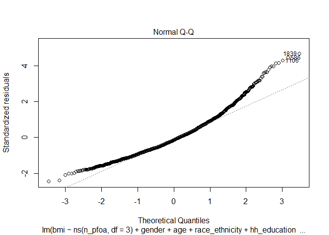
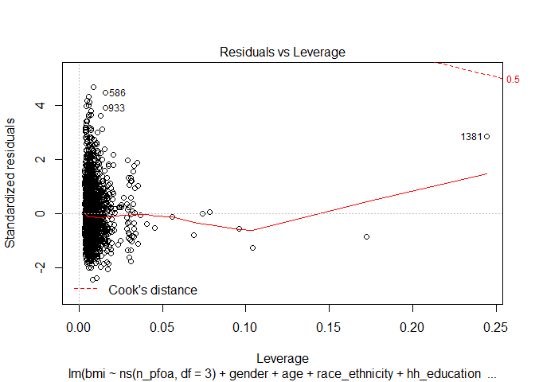
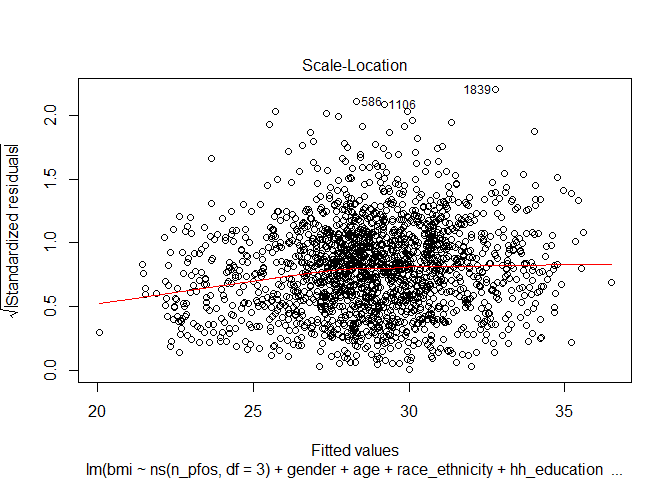
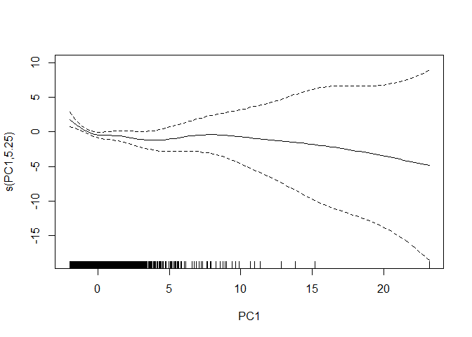
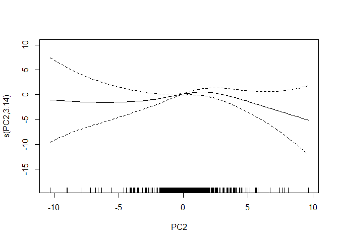
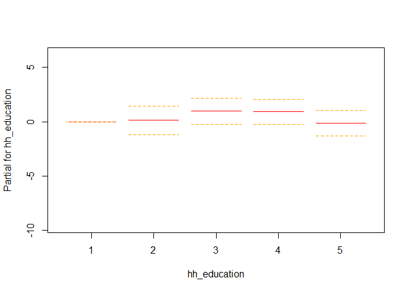
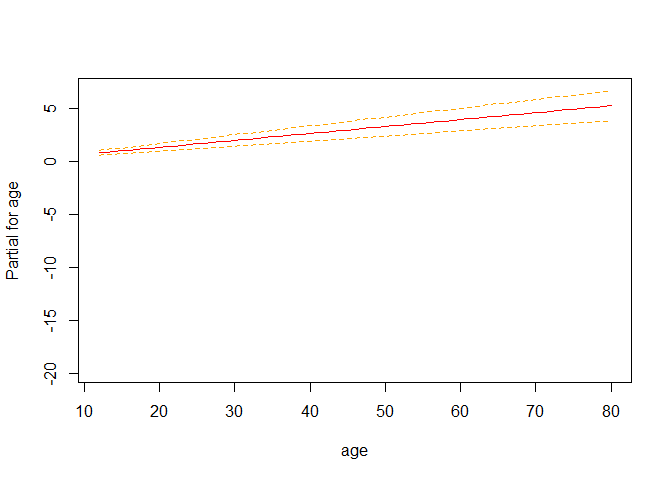

rnhanes\_nonlinear
================
SL
March 22, 2019

-   [Tables](#tables)
-   [Correlations](#correlations)
-   [Linear](#linear)
    -   [Linear, no additional variables](#linear-no-additional-variables)
    -   [Linear, simple model](#linear-simple-model)
-   [Natural Spline Term](#natural-spline-term)
    -   [glm natural spline](#glm-natural-spline)
    -   [gam natural spline](#gam-natural-spline)
-   [Penalized spline](#penalized-spline)

Load dataset from pipeline output

``` r
pfas <- read.csv("aamehs_data.csv") %>% 
   select(seqn, gender, age, race_ethnicity, hh_education, diabetes, pfdea, pfhxs, me_pfosa_acoh, pfna, pfua, pfdoa, n_pfoa, sb_pfoa, n_pfos, sm_pfos, bmi) %>% 
  mutate(gender = factor(gender),
         race_ethnicity = factor(race_ethnicity),
         hh_education = factor(hh_education),
         diabetes = factor(diabetes)) %>% 
  drop_na()

glimpse(pfas)
```

    ## Observations: 1,904
    ## Variables: 17
    ## $ seqn           <int> 83736, 83745, 83754, 83762, 83767, 83769, 83770...
    ## $ gender         <fct> 2, 2, 2, 2, 2, 1, 1, 2, 2, 1, 2, 1, 2, 1, 2, 2,...
    ## $ age            <int> 42, 15, 67, 27, 54, 49, 15, 13, 58, 16, 27, 17,...
    ## $ race_ethnicity <fct> 4, 3, 2, 4, 6, 6, 4, 3, 1, 2, 4, 3, 3, 3, 3, 3,...
    ## $ hh_education   <fct> 4, 4, 5, 3, 4, 2, 4, 4, 5, 3, 5, 4, 5, 5, 2, 4,...
    ## $ diabetes       <fct> 2, 2, 2, 2, 2, 2, 2, 2, 2, 2, 2, 2, 2, 2, 2, 2,...
    ## $ pfdea          <dbl> 0.10, 0.07, 0.10, 0.07, 0.40, 0.50, 0.20, 0.10,...
    ## $ pfhxs          <dbl> 0.6, 1.4, 1.2, 0.2, 0.5, 2.5, 0.4, 0.8, 3.5, 0....
    ## $ me_pfosa_acoh  <dbl> 0.07, 0.07, 0.10, 0.20, 0.07, 0.07, 0.07, 0.07,...
    ## $ pfna           <dbl> 0.5, 1.4, 1.0, 0.4, 2.1, 1.5, 0.4, 0.3, 1.5, 0....
    ## $ pfua           <dbl> 0.20, 0.07, 0.07, 0.07, 0.30, 0.30, 0.10, 0.07,...
    ## $ pfdoa          <dbl> 0.07, 0.07, 0.07, 0.07, 0.07, 0.07, 0.07, 0.07,...
    ## $ n_pfoa         <dbl> 0.9, 1.4, 2.8, 0.5, 1.7, 2.3, 0.5, 1.2, 2.9, 0....
    ## $ sb_pfoa        <dbl> 0.07, 0.07, 0.07, 0.07, 0.07, 0.07, 0.07, 0.07,...
    ## $ n_pfos         <dbl> 3.8, 1.6, 6.1, 0.9, 7.0, 10.0, 1.7, 1.4, 9.9, 1...
    ## $ sm_pfos        <dbl> 0.6, 0.8, 5.4, 0.4, 1.0, 3.9, 0.3, 0.7, 4.7, 0....
    ## $ bmi            <dbl> 20.3, 25.0, 43.7, 38.0, 26.3, 25.0, 18.3, 19.4,...

``` r
#check for missing values
pfas %>% 
  select_if(function(x) any(is.na(x))) %>% 
  summarise_each(funs(sum(is.na(.)))) 
```

    ## Warning: funs() is soft deprecated as of dplyr 0.8.0
    ## please use list() instead
    ## 
    ## # Before:
    ## funs(name = f(.)
    ## 
    ## # After: 
    ## list(name = ~f(.))
    ## This warning is displayed once per session.

    ## data frame with 0 columns and 1 row

Missing values: indfmpir = 201 hh\_education = 71 bmxbmi = 16

Tables
------

``` r
pfas %>% 
  select(-seqn, gender, age, race_ethnicity, hh_education, diabetes, bmi, everything()) %>% 
  summarise_at(vars(age, bmi, pfdea:sm_pfos), list(~mean(.), ~sd(.)), na.rm = TRUE)
```

    ##   age_mean bmi_mean pfdea_mean pfhxs_mean me_pfosa_acoh_mean pfna_mean
    ## 1 43.41544  28.8291  0.2530305   1.608682          0.1703676 0.7742542
    ##   pfua_mean pfdoa_mean n_pfoa_mean sb_pfoa_mean n_pfos_mean sm_pfos_mean
    ## 1 0.1574632 0.07157038    1.808692   0.07203782    5.126471     1.946082
    ##     age_sd   bmi_sd  pfdea_sd pfhxs_sd me_pfosa_acoh_sd   pfna_sd
    ## 1 20.54267 7.080604 0.4279689 1.755956        0.2759503 0.6634032
    ##     pfua_sd   pfdoa_sd n_pfoa_sd sb_pfoa_sd n_pfos_sd sm_pfos_sd
    ## 1 0.2527075 0.01348409  1.583928 0.02066286   6.87003   1.871937

``` r
pfas %>% 
  select(gender, age, race_ethnicity, hh_education, diabetes, bmi, everything(), -seqn) %>% 
  summary(.) 
```

    ##  gender       age        race_ethnicity hh_education diabetes
    ##  1:932   Min.   :12.00   1:340          1:205        1: 218  
    ##  2:972   1st Qu.:25.00   2:245          2:230        2:1647  
    ##          Median :43.00   3:602          3:399        3:  39  
    ##          Mean   :43.42   4:429          4:615                
    ##          3rd Qu.:61.00   6:207          5:455                
    ##          Max.   :80.00   7: 81                               
    ##       bmi            pfdea           pfhxs        me_pfosa_acoh   
    ##  Min.   :14.50   Min.   :0.070   Min.   : 0.070   Min.   :0.0700  
    ##  1st Qu.:23.70   1st Qu.:0.070   1st Qu.: 0.600   1st Qu.:0.0700  
    ##  Median :27.80   Median :0.100   Median : 1.200   Median :0.0700  
    ##  Mean   :28.83   Mean   :0.253   Mean   : 1.609   Mean   :0.1704  
    ##  3rd Qu.:32.73   3rd Qu.:0.300   3rd Qu.: 1.900   3rd Qu.:0.2000  
    ##  Max.   :64.50   Max.   :6.500   Max.   :23.300   Max.   :4.2000  
    ##       pfna             pfua            pfdoa             n_pfoa      
    ##  Min.   :0.0700   Min.   :0.0700   Min.   :0.07000   Min.   : 0.070  
    ##  1st Qu.:0.4000   1st Qu.:0.0700   1st Qu.:0.07000   1st Qu.: 0.900  
    ##  Median :0.6000   Median :0.0700   Median :0.07000   Median : 1.400  
    ##  Mean   :0.7743   Mean   :0.1575   Mean   :0.07157   Mean   : 1.809  
    ##  3rd Qu.:1.0000   3rd Qu.:0.2000   3rd Qu.:0.07000   3rd Qu.: 2.200  
    ##  Max.   :8.4000   Max.   :4.2000   Max.   :0.30000   Max.   :19.200  
    ##     sb_pfoa            n_pfos           sm_pfos      
    ##  Min.   :0.07000   Min.   :  0.070   Min.   : 0.070  
    ##  1st Qu.:0.07000   1st Qu.:  1.800   1st Qu.: 0.700  
    ##  Median :0.07000   Median :  3.200   Median : 1.400  
    ##  Mean   :0.07204   Mean   :  5.126   Mean   : 1.946  
    ##  3rd Qu.:0.07000   3rd Qu.:  5.800   3rd Qu.: 2.500  
    ##  Max.   :0.50000   Max.   :109.900   Max.   :19.200

``` r
pfas %>% 
  select(gender, age, race_ethnicity, hh_education, diabetes, bmi, everything(), -seqn) %>% 
  group_by(gender) %>%   
  summarise_all(mean) %>% 
  select(-(race_ethnicity:diabetes)) %>% 
  knitr::kable()
```

| gender |       age|       bmi|      pfdea|     pfhxs|  me\_pfosa\_acoh|       pfna|       pfua|      pfdoa|   n\_pfoa|   sb\_pfoa|   n\_pfos|  sm\_pfos|
|:-------|---------:|---------:|----------:|---------:|----------------:|----------:|----------:|----------:|---------:|----------:|---------:|---------:|
| 1      |  42.55901|  28.21084|  0.2520923|  1.952618|        0.1825536|  0.8193133|  0.1571674|  0.0717060|  1.976599|  0.0721030|  6.114066|  2.398315|
| 2      |  44.23663|  29.42191|  0.2539300|  1.278899|        0.1586831|  0.7310494|  0.1577469|  0.0714403|  1.647695|  0.0719753|  4.179517|  1.512459|

``` r
pfas %>% 
  select(gender, age, race_ethnicity, hh_education, diabetes, bmi, everything(), -seqn) %>% 
  group_by(race_ethnicity) %>%   
  summarise_all(mean) %>% 
  select(-gender, -hh_education, -diabetes) %>% 
  knitr::kable()
```

| race\_ethnicity |       age|       bmi|      pfdea|     pfhxs|  me\_pfosa\_acoh|       pfna|       pfua|      pfdoa|   n\_pfoa|   sb\_pfoa|   n\_pfos|  sm\_pfos|
|:----------------|---------:|---------:|----------:|---------:|----------------:|----------:|----------:|----------:|---------:|----------:|---------:|---------:|
| 1               |  41.19412|  29.97529|  0.1796765|  1.298971|        0.1250000|  0.6561176|  0.0922059|  0.0703529|  1.390706|  0.0705294|  3.272265|  1.476794|
| 2               |  43.21633|  29.26612|  0.2022041|  1.562653|        0.1183265|  0.8235510|  0.1195510|  0.0722041|  1.805714|  0.0802449|  4.388980|  1.800694|
| 3               |  46.68605|  28.27159|  0.2118272|  1.919120|        0.2211130|  0.7393023|  0.1207143|  0.0709468|  2.011661|  0.0703156|  4.773439|  2.276777|
| 4               |  42.86014|  30.32774|  0.2560606|  1.606620|        0.1720280|  0.7828904|  0.1690443|  0.0713287|  1.765781|  0.0721911|  6.216270|  2.076224|
| 6               |  40.42995|  24.56425|  0.5577295|  1.274927|        0.1537681|  1.0193720|  0.3958454|  0.0743478|  2.042029|  0.0702899|  8.226425|  1.751546|
| 7               |  39.60494|  29.80123|  0.2261728|  1.604568|        0.1746914|  0.7086420|  0.1486420|  0.0735802|  1.694691|  0.0700000|  4.070000|  1.705803|

Correlations
------------

``` r
cor_pfas <-
  pfas %>% 
    select(bmi, everything(), -(seqn:diabetes)) %>% 
    scale() %>% 
    cor()
  
cor_pfas %>%
  corrplot::corrplot.mixed(., lower = "number", upper = "ellipse",
                           tl.col = "black", tl.srt = 90)
```


``` r
cor_pfas %>%
  corrplot::corrplot(., type = "upper", order = "hclust",
         col = c("black", "white"), bg = "lightblue")
```


Linear
------

### Linear, no additional variables

``` r
pfoa_linear_single <- lm(bmi ~ n_pfoa, data = pfas)

summary(pfoa_linear_single)
```

    ## 
    ## Call:
    ## lm(formula = bmi ~ n_pfoa, data = pfas)
    ## 
    ## Residuals:
    ##     Min      1Q  Median      3Q     Max 
    ## -14.436  -5.114  -0.994   3.876  35.715 
    ## 
    ## Coefficients:
    ##             Estimate Std. Error t value Pr(>|t|)    
    ## (Intercept)  29.1031     0.2463 118.178   <2e-16 ***
    ## n_pfoa       -0.1515     0.1024  -1.479    0.139    
    ## ---
    ## Signif. codes:  0 '***' 0.001 '**' 0.01 '*' 0.05 '.' 0.1 ' ' 1
    ## 
    ## Residual standard error: 7.078 on 1902 degrees of freedom
    ## Multiple R-squared:  0.001148,   Adjusted R-squared:  0.0006233 
    ## F-statistic: 2.187 on 1 and 1902 DF,  p-value: 0.1393

``` r
pfoa_linear_single %>% 
  predict(., se.fit = TRUE, type = "terms" ) %>% 
  as.data.frame(.) %>% 
  mutate(pred = n_pfoa) %>% 
  select(pred) %>% 
  bind_cols(pfas) %>% 
  mutate(pred_bmi = pred + mean(bmi)) %>% 
  ggplot(., aes(x = n_pfoa)) + 
    geom_line(aes(y = pred_bmi)) + 
    xlab("n_pfoa") + 
    ylab("Predicted BMI") 
```


``` r
pfos_linear_single <- lm(bmi ~ n_pfos, data = pfas)

summary(pfos_linear_single)
```

    ## 
    ## Call:
    ## lm(formula = bmi ~ n_pfos, data = pfas)
    ## 
    ## Residuals:
    ##     Min      1Q  Median      3Q     Max 
    ## -14.382  -5.134  -0.956   3.960  36.386 
    ## 
    ## Coefficients:
    ##             Estimate Std. Error t value Pr(>|t|)    
    ## (Intercept) 28.97642    0.20246 143.120   <2e-16 ***
    ## n_pfos      -0.02874    0.02362  -1.217    0.224    
    ## ---
    ## Signif. codes:  0 '***' 0.001 '**' 0.01 '*' 0.05 '.' 0.1 ' ' 1
    ## 
    ## Residual standard error: 7.08 on 1902 degrees of freedom
    ## Multiple R-squared:  0.0007775,  Adjusted R-squared:  0.0002521 
    ## F-statistic:  1.48 on 1 and 1902 DF,  p-value: 0.2239

### Linear, simple model

``` r
pfoa_linear <- lm(bmi ~ n_pfoa + gender + age + race_ethnicity + hh_education + diabetes, 
              data = pfas)

summary(pfoa_linear)
```

    ## 
    ## Call:
    ## lm(formula = bmi ~ n_pfoa + gender + age + race_ethnicity + hh_education + 
    ##     diabetes, data = pfas)
    ## 
    ## Residuals:
    ##      Min       1Q   Median       3Q      Max 
    ## -16.3477  -4.5997  -0.9333   3.5808  30.5830 
    ## 
    ## Coefficients:
    ##                  Estimate Std. Error t value Pr(>|t|)    
    ## (Intercept)     29.513064   0.817254  36.112  < 2e-16 ***
    ## n_pfoa          -0.202550   0.100871  -2.008 0.044785 *  
    ## gender2          0.953644   0.308163   3.095 0.002000 ** 
    ## age              0.056915   0.008181   6.957 4.77e-12 ***
    ## race_ethnicity2 -0.839284   0.565443  -1.484 0.137898    
    ## race_ethnicity3 -1.770201   0.488033  -3.627 0.000294 ***
    ## race_ethnicity4  0.100149   0.508496   0.197 0.843887    
    ## race_ethnicity6 -4.942241   0.615004  -8.036 1.62e-15 ***
    ## race_ethnicity7 -0.140726   0.836074  -0.168 0.866352    
    ## hh_education2    0.099078   0.648404   0.153 0.878570    
    ## hh_education3    0.928424   0.593149   1.565 0.117693    
    ## hh_education4    0.872793   0.572275   1.525 0.127394    
    ## hh_education5   -0.218083   0.598961  -0.364 0.715822    
    ## diabetes2       -2.896463   0.509731  -5.682 1.54e-08 ***
    ## diabetes3       -0.871230   1.162479  -0.749 0.453674    
    ## ---
    ## Signif. codes:  0 '***' 0.001 '**' 0.01 '*' 0.05 '.' 0.1 ' ' 1
    ## 
    ## Residual standard error: 6.65 on 1889 degrees of freedom
    ## Multiple R-squared:  0.1245, Adjusted R-squared:  0.118 
    ## F-statistic: 19.18 on 14 and 1889 DF,  p-value: < 2.2e-16

``` r
pfoa_linear %>% 
  broom::tidy() %>% 
  select(-statistic) %>% 
  knitr::kable(digits = 3)
```

| term             |  estimate|  std.error|  p.value|
|:-----------------|---------:|----------:|--------:|
| (Intercept)      |    29.513|      0.817|    0.000|
| n\_pfoa          |    -0.203|      0.101|    0.045|
| gender2          |     0.954|      0.308|    0.002|
| age              |     0.057|      0.008|    0.000|
| race\_ethnicity2 |    -0.839|      0.565|    0.138|
| race\_ethnicity3 |    -1.770|      0.488|    0.000|
| race\_ethnicity4 |     0.100|      0.508|    0.844|
| race\_ethnicity6 |    -4.942|      0.615|    0.000|
| race\_ethnicity7 |    -0.141|      0.836|    0.866|
| hh\_education2   |     0.099|      0.648|    0.879|
| hh\_education3   |     0.928|      0.593|    0.118|
| hh\_education4   |     0.873|      0.572|    0.127|
| hh\_education5   |    -0.218|      0.599|    0.716|
| diabetes2        |    -2.896|      0.510|    0.000|
| diabetes3        |    -0.871|      1.162|    0.454|

``` r
pfoa_linear %>% 
  predict(., se.fit = TRUE, type = "terms" ) %>% 
  as.data.frame(.) %>% 
  mutate(pred = fit.n_pfoa) %>% 
  select(pred) %>% 
  bind_cols(pfas) %>% 
  mutate(pred_bmi = pred + mean(bmi)) %>% 
  ggplot(., aes(x = n_pfoa)) + 
    geom_line(aes(y = pred_bmi)) + 
    xlab("n_pfoa") + 
    ylab("Predicted BMI") 
```


``` r
pfos_linear <- lm(bmi ~ n_pfos + gender + age + race_ethnicity + hh_education + diabetes, 
              data = pfas)

summary(pfos_linear)
```

    ## 
    ## Call:
    ## lm(formula = bmi ~ n_pfos + gender + age + race_ethnicity + hh_education + 
    ##     diabetes, data = pfas)
    ## 
    ## Residuals:
    ##     Min      1Q  Median      3Q     Max 
    ## -16.469  -4.635  -0.920   3.514  32.004 
    ## 
    ## Coefficients:
    ##                  Estimate Std. Error t value Pr(>|t|)    
    ## (Intercept)     29.441148   0.815901  36.084  < 2e-16 ***
    ## n_pfos          -0.062418   0.024575  -2.540 0.011170 *  
    ## gender2          0.888646   0.310590   2.861 0.004267 ** 
    ## age              0.060124   0.008421   7.140 1.33e-12 ***
    ## race_ethnicity2 -0.828836   0.564894  -1.467 0.142477    
    ## race_ethnicity3 -1.760280   0.487385  -3.612 0.000312 ***
    ## race_ethnicity4  0.256778   0.514314   0.499 0.617652    
    ## race_ethnicity6 -4.699664   0.627863  -7.485 1.09e-13 ***
    ## race_ethnicity7 -0.100898   0.835919  -0.121 0.903939    
    ## hh_education2    0.010429   0.647799   0.016 0.987157    
    ## hh_education3    0.807639   0.592955   1.362 0.173342    
    ## hh_education4    0.715616   0.573011   1.249 0.211867    
    ## hh_education5   -0.429129   0.600141  -0.715 0.474669    
    ## diabetes2       -2.908855   0.508950  -5.715 1.27e-08 ***
    ## diabetes3       -0.895537   1.161393  -0.771 0.440751    
    ## ---
    ## Signif. codes:  0 '***' 0.001 '**' 0.01 '*' 0.05 '.' 0.1 ' ' 1
    ## 
    ## Residual standard error: 6.646 on 1889 degrees of freedom
    ## Multiple R-squared:  0.1256, Adjusted R-squared:  0.1191 
    ## F-statistic: 19.38 on 14 and 1889 DF,  p-value: < 2.2e-16

Natural Spline Term
-------------------

### glm natural spline

``` r
ns_pfoa <- lm(bmi ~ ns(n_pfoa, df = 3) + gender + age + race_ethnicity + hh_education + diabetes, data = pfas)

summary(ns_pfoa)
```

    ## 
    ## Call:
    ## lm(formula = bmi ~ ns(n_pfoa, df = 3) + gender + age + race_ethnicity + 
    ##     hh_education + diabetes, data = pfas)
    ## 
    ## Residuals:
    ##      Min       1Q   Median       3Q      Max 
    ## -16.2379  -4.5620  -0.9139   3.5856  30.9111 
    ## 
    ## Coefficients:
    ##                      Estimate Std. Error t value Pr(>|t|)    
    ## (Intercept)         30.301256   1.006603  30.102  < 2e-16 ***
    ## ns(n_pfoa, df = 3)1 -2.182398   1.434935  -1.521 0.128452    
    ## ns(n_pfoa, df = 3)2 -3.780270   2.035659  -1.857 0.063463 .  
    ## ns(n_pfoa, df = 3)3 -1.868882   3.273134  -0.571 0.568084    
    ## gender2              0.811873   0.318821   2.546 0.010960 *  
    ## age                  0.059531   0.008403   7.084 1.97e-12 ***
    ## race_ethnicity2     -0.778296   0.566569  -1.374 0.169698    
    ## race_ethnicity3     -1.714197   0.489173  -3.504 0.000469 ***
    ## race_ethnicity4      0.110044   0.508957   0.216 0.828843    
    ## race_ethnicity6     -4.905887   0.615547  -7.970 2.72e-15 ***
    ## race_ethnicity7     -0.072996   0.836841  -0.087 0.930500    
    ## hh_education2        0.118562   0.648400   0.183 0.854933    
    ## hh_education3        0.958121   0.593252   1.615 0.106471    
    ## hh_education4        0.911730   0.572826   1.592 0.111634    
    ## hh_education5       -0.142874   0.600838  -0.238 0.812068    
    ## diabetes2           -2.828724   0.511295  -5.532 3.60e-08 ***
    ## diabetes3           -0.733206   1.164919  -0.629 0.529160    
    ## ---
    ## Signif. codes:  0 '***' 0.001 '**' 0.01 '*' 0.05 '.' 0.1 ' ' 1
    ## 
    ## Residual standard error: 6.648 on 1887 degrees of freedom
    ## Multiple R-squared:  0.1259, Adjusted R-squared:  0.1184 
    ## F-statistic: 16.98 on 16 and 1887 DF,  p-value: < 2.2e-16

``` r
AIC(ns_pfoa)
```

    ## [1] 12635.82

``` r
ns_pfoa %>% 
  broom::tidy() %>% 
  select(-statistic) %>% 
  knitr::kable(digits = 3)
```

| term                 |  estimate|  std.error|  p.value|
|:---------------------|---------:|----------:|--------:|
| (Intercept)          |    30.301|      1.007|    0.000|
| ns(n\_pfoa, df = 3)1 |    -2.182|      1.435|    0.128|
| ns(n\_pfoa, df = 3)2 |    -3.780|      2.036|    0.063|
| ns(n\_pfoa, df = 3)3 |    -1.869|      3.273|    0.568|
| gender2              |     0.812|      0.319|    0.011|
| age                  |     0.060|      0.008|    0.000|
| race\_ethnicity2     |    -0.778|      0.567|    0.170|
| race\_ethnicity3     |    -1.714|      0.489|    0.000|
| race\_ethnicity4     |     0.110|      0.509|    0.829|
| race\_ethnicity6     |    -4.906|      0.616|    0.000|
| race\_ethnicity7     |    -0.073|      0.837|    0.930|
| hh\_education2       |     0.119|      0.648|    0.855|
| hh\_education3       |     0.958|      0.593|    0.106|
| hh\_education4       |     0.912|      0.573|    0.112|
| hh\_education5       |    -0.143|      0.601|    0.812|
| diabetes2            |    -2.829|      0.511|    0.000|
| diabetes3            |    -0.733|      1.165|    0.529|

``` r
plot(ns_pfoa)
```



``` r
ns_pfoa %>% 
 predict(., se.fit = TRUE, type = "terms" ) %>% 
 as.data.frame(.) %>% 
  mutate(pred = fit.ns.n_pfoa..df...3.,
         se = se.fit.ns.n_pfoa..df...3.,
         lci = pred - 1.96*se,
         uci = pred + 1.96*se) %>%
  select(pred, se, lci, uci) %>% 
  bind_cols(pfas) %>% 
  mutate(pred_bmi = pred + mean(bmi),
         lci_bmi = lci + mean(bmi),
         uci_bmi = uci + mean(bmi)) %>% 
  ggplot(., aes(n_pfoa)) + 
      geom_line(aes(y = pred_bmi)) + 
      geom_line(aes(y = lci_bmi), color = "darkgrey") + 
      geom_line(aes(y = uci_bmi), color = "darkgrey") + 
      xlab("n_pfoa") + 
      ylab("Predicted BMI (95% CI)") +
      ylim(20,35)
```


``` r
ns_pfos <- lm(bmi ~ ns(n_pfos, df = 3) + gender + age + race_ethnicity + hh_education + diabetes, data = pfas)

summary(ns_pfos)
```

    ## 
    ## Call:
    ## lm(formula = bmi ~ ns(n_pfos, df = 3) + gender + age + race_ethnicity + 
    ##     hh_education + diabetes, data = pfas)
    ## 
    ## Residuals:
    ##     Min      1Q  Median      3Q     Max 
    ## -16.033  -4.598  -0.869   3.486  31.711 
    ## 
    ## Coefficients:
    ##                      Estimate Std. Error t value Pr(>|t|)    
    ## (Intercept)         30.756711   0.947475  32.462  < 2e-16 ***
    ## ns(n_pfos, df = 3)1 -1.616244   1.847733  -0.875  0.38184    
    ## ns(n_pfos, df = 3)2 -7.982184   2.544630  -3.137  0.00173 ** 
    ## ns(n_pfos, df = 3)3 -8.524726   4.808239  -1.773  0.07640 .  
    ## gender2              0.688914   0.322208   2.138  0.03264 *  
    ## age                  0.065317   0.008889   7.348 2.99e-13 ***
    ## race_ethnicity2     -0.806308   0.564724  -1.428  0.15352    
    ## race_ethnicity3     -1.707605   0.487377  -3.504  0.00047 ***
    ## race_ethnicity4      0.289700   0.515645   0.562  0.57430    
    ## race_ethnicity6     -4.731936   0.629406  -7.518 8.54e-14 ***
    ## race_ethnicity7     -0.007916   0.835674  -0.009  0.99244    
    ## hh_education2       -0.010283   0.646928  -0.016  0.98732    
    ## hh_education3        0.842058   0.592280   1.422  0.15527    
    ## hh_education4        0.740677   0.572258   1.294  0.19572    
    ## hh_education5       -0.358521   0.599916  -0.598  0.55017    
    ## diabetes2           -2.817433   0.509344  -5.531 3.62e-08 ***
    ## diabetes3           -0.760878   1.160762  -0.655  0.51223    
    ## ---
    ## Signif. codes:  0 '***' 0.001 '**' 0.01 '*' 0.05 '.' 0.1 ' ' 1
    ## 
    ## Residual standard error: 6.636 on 1887 degrees of freedom
    ## Multiple R-squared:  0.129,  Adjusted R-squared:  0.1217 
    ## F-statistic: 17.47 on 16 and 1887 DF,  p-value: < 2.2e-16

``` r
AIC(ns_pfos)
```

    ## [1] 12628.88

``` r
plot(ns_pfos)
```



``` r
ns_pfos %>% 
 predict(., se.fit = TRUE, type = "terms" ) %>% 
 as.data.frame(.) %>% 
  mutate(pred = fit.ns.n_pfos..df...3.,
         se = se.fit.ns.n_pfos..df...3.,
         lci = pred - 1.96*se,
         uci = pred + 1.96*se) %>%
  select(pred, se, lci, uci) %>% 
  bind_cols(pfas) %>% 
  mutate(pred_bmi = pred + mean(bmi),
         lci_bmi = lci + mean(bmi),
         uci_bmi = uci + mean(bmi)) %>% 
  ggplot(., aes(n_pfos)) + 
      geom_line(aes(y = pred_bmi)) + 
      geom_line(aes(y = lci_bmi), color = "darkgrey") + 
      geom_line(aes(y = uci_bmi), color = "darkgrey") + 
      xlab("n_pfos") + 
      ylab("Predicted BMI (95% CI)") +
      ylim(20,35)
```

    ## Warning: Removed 2 rows containing missing values (geom_path).


### gam natural spline

``` r
pfos_gam_ns <- gam(bmi ~ ns(n_pfos, df = 3) + gender + age + race_ethnicity + hh_education + diabetes, data = pfas)

termplot(pfos_gam_ns, se = TRUE)
```



Penalized spline
----------------

``` r
ps_pfoa <- gam(bmi ~ s(n_pfoa) + gender + age + race_ethnicity + hh_education + diabetes, data = pfas)

summary(ps_pfoa)
```

    ## 
    ## Family: gaussian 
    ## Link function: identity 
    ## 
    ## Formula:
    ## bmi ~ s(n_pfoa) + gender + age + race_ethnicity + hh_education + 
    ##     diabetes
    ## 
    ## Parametric coefficients:
    ##                  Estimate Std. Error t value Pr(>|t|)    
    ## (Intercept)     28.985310   0.838541  34.566  < 2e-16 ***
    ## gender2          0.816207   0.319995   2.551 0.010830 *  
    ## age              0.059358   0.008432   7.040 2.69e-12 ***
    ## race_ethnicity2 -0.774182   0.566742  -1.366 0.172095    
    ## race_ethnicity3 -1.710872   0.489488  -3.495 0.000485 ***
    ## race_ethnicity4  0.089882   0.508734   0.177 0.859780    
    ## race_ethnicity6 -4.874903   0.615521  -7.920 4.02e-15 ***
    ## race_ethnicity7 -0.080613   0.836222  -0.096 0.923212    
    ## hh_education2    0.125907   0.647837   0.194 0.845923    
    ## hh_education3    0.952607   0.592752   1.607 0.108202    
    ## hh_education4    0.887894   0.572341   1.551 0.120988    
    ## hh_education5   -0.164100   0.600341  -0.273 0.784619    
    ## diabetes2       -2.824682   0.510584  -5.532 3.60e-08 ***
    ## diabetes3       -0.742396   1.163543  -0.638 0.523520    
    ## ---
    ## Signif. codes:  0 '***' 0.001 '**' 0.01 '*' 0.05 '.' 0.1 ' ' 1
    ## 
    ## Approximate significance of smooth terms:
    ##             edf Ref.df     F p-value  
    ## s(n_pfoa) 6.006  7.017 1.745  0.0927 .
    ## ---
    ## Signif. codes:  0 '***' 0.001 '**' 0.01 '*' 0.05 '.' 0.1 ' ' 1
    ## 
    ## R-sq.(adj) =  0.121   Deviance explained =   13%
    ## GCV = 44.547  Scale est. = 44.079    n = 1904

``` r
ps_pfoa$sp   # extract Penalty 
```

    ##  s(n_pfoa) 
    ## 0.02199917

``` r
plot(ps_pfoa)
```


``` r
ps_pfoa %>% 
  broom::tidy() %>% 
  select(-statistic) %>% 
  knitr::kable(digits = 3)
```

| term       |    edf|  ref.df|  p.value|
|:-----------|------:|-------:|--------:|
| s(n\_pfoa) |  6.006|   7.017|    0.093|

``` r
ps_pfoa %>% 
 predict(., se.fit = TRUE, type = "terms" ) %>% 
 as.data.frame(.) %>% 
  mutate(pred = fit.s.n_pfoa.,
         se = se.fit.s.n_pfoa.,
         lci = pred - 1.96*se,
         uci = pred + 1.96*se) %>%
  select(pred, se, lci, uci) %>% 
  bind_cols(pfas) %>% 
  mutate(pred_bmi = pred + mean(bmi),
         lci_bmi = lci + mean(bmi),
         uci_bmi = uci + mean(bmi)) %>% 
  ggplot(., aes(n_pfoa)) + 
      geom_line(aes(y = pred_bmi)) + 
      geom_line(aes(y = lci_bmi), color = "darkgrey") + 
      geom_line(aes(y = uci_bmi), color = "darkgrey") + 
      xlab("n_pfoa") + 
      ylab("Predicted BMI (95% CI)") +
      ylim(20,35)
```

    ## Warning: Removed 1 rows containing missing values (geom_path).

    ## Warning: Removed 2 rows containing missing values (geom_path).


``` r
ps_pfos <- gam(bmi ~ s(n_pfos) + gender + age + race_ethnicity + hh_education + diabetes, data = pfas)
summary(ps_pfos)
```

    ## 
    ## Family: gaussian 
    ## Link function: identity 
    ## 
    ## Formula:
    ## bmi ~ s(n_pfos) + gender + age + race_ethnicity + hh_education + 
    ##     diabetes
    ## 
    ## Parametric coefficients:
    ##                  Estimate Std. Error t value Pr(>|t|)    
    ## (Intercept)     29.121166   0.825442  35.279  < 2e-16 ***
    ## gender2          0.888646   0.310590   2.861 0.004267 ** 
    ## age              0.060124   0.008421   7.140 1.33e-12 ***
    ## race_ethnicity2 -0.828836   0.564894  -1.467 0.142477    
    ## race_ethnicity3 -1.760280   0.487385  -3.612 0.000312 ***
    ## race_ethnicity4  0.256778   0.514314   0.499 0.617652    
    ## race_ethnicity6 -4.699664   0.627863  -7.485 1.09e-13 ***
    ## race_ethnicity7 -0.100898   0.835919  -0.121 0.903939    
    ## hh_education2    0.010429   0.647799   0.016 0.987157    
    ## hh_education3    0.807639   0.592955   1.362 0.173342    
    ## hh_education4    0.715616   0.573011   1.249 0.211867    
    ## hh_education5   -0.429129   0.600141  -0.715 0.474669    
    ## diabetes2       -2.908855   0.508950  -5.715 1.27e-08 ***
    ## diabetes3       -0.895537   1.161393  -0.771 0.440751    
    ## ---
    ## Signif. codes:  0 '***' 0.001 '**' 0.01 '*' 0.05 '.' 0.1 ' ' 1
    ## 
    ## Approximate significance of smooth terms:
    ##           edf Ref.df     F p-value  
    ## s(n_pfos)   1      1 6.451  0.0112 *
    ## ---
    ## Signif. codes:  0 '***' 0.001 '**' 0.01 '*' 0.05 '.' 0.1 ' ' 1
    ## 
    ## R-sq.(adj) =  0.119   Deviance explained = 12.6%
    ## GCV = 44.514  Scale est. = 44.163    n = 1904

``` r
ps_pfos$sp   # extract Penalty 
```

    ##  s(n_pfos) 
    ## 4689327083

``` r
plot(ps_pfos)
```



``` r
ps_pfos %>% 
 predict(., se.fit = TRUE, type = "terms" ) %>% 
 as.data.frame(.) %>% 
  mutate(pred = fit.s.n_pfos.,
         se = se.fit.s.n_pfos.,
         lci = pred - 1.96*se,
         uci = pred + 1.96*se) %>%
  select(pred, se, lci, uci) %>% 
  bind_cols(pfas) %>% 
  mutate(pred_bmi = pred + mean(bmi),
         lci_bmi = lci + mean(bmi),
         uci_bmi = uci + mean(bmi)) %>% 
  ggplot(., aes(n_pfos)) + 
      geom_line(aes(y = pred_bmi)) + 
      geom_line(aes(y = lci_bmi), color = "darkgrey") + 
      geom_line(aes(y = uci_bmi), color = "darkgrey") + 
      xlab("n_pfos") + 
      ylab("Predicted BMI (95% CI)") +
      ylim(20,35)
```

    ## Warning: Removed 1 rows containing missing values (geom_path).


