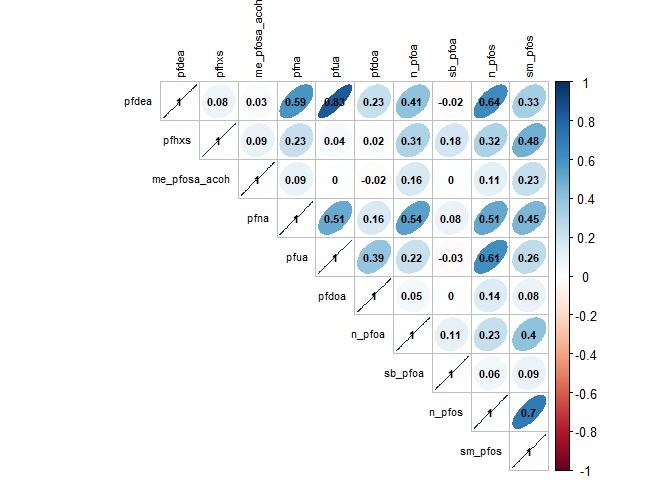
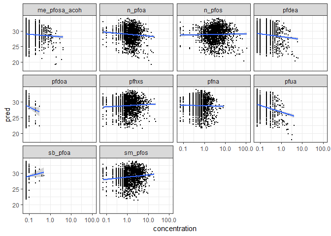
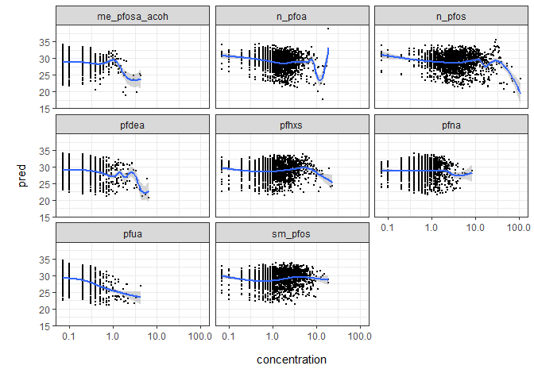
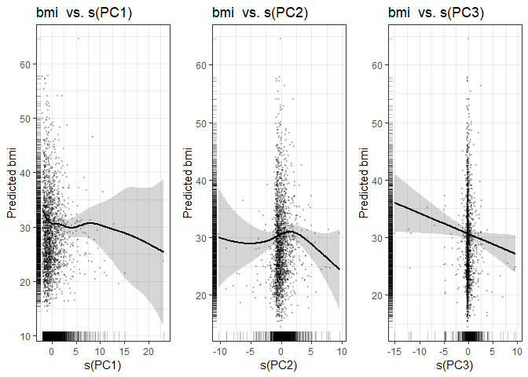
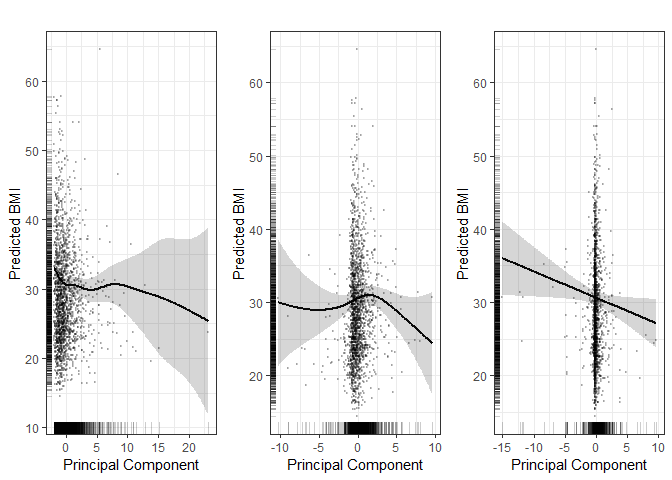
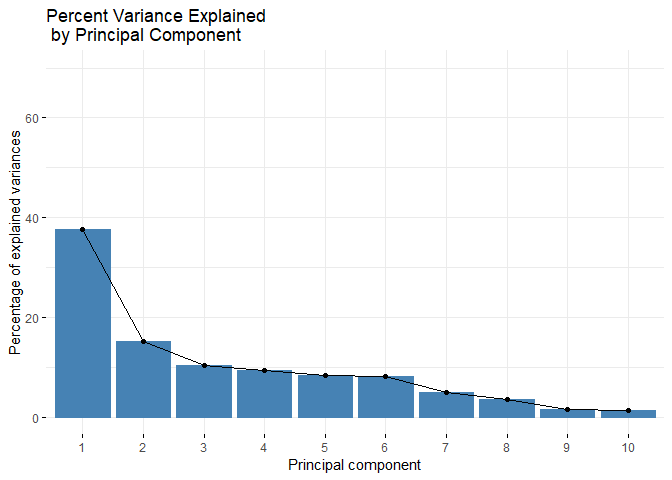
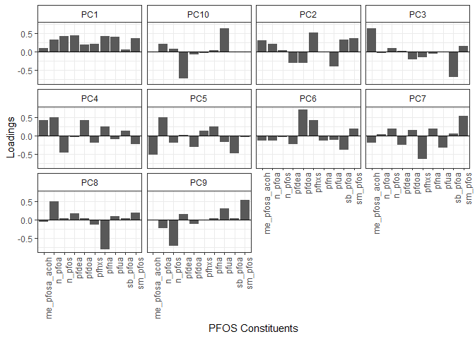
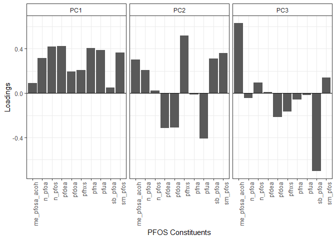

rnhanes\_nonlinear\_final
================
SL
April 17, 2019

-   [Data Summary](#data-summary)
-   [Plots](#plots)
-   [Correlations](#correlations)
-   [Linear](#linear)
    -   [PFAS beta coefficient estimate and model summary statistics](#pfas-beta-coefficient-estimate-and-model-summary-statistics)
    -   [Linear predicted values plots](#linear-predicted-values-plots)
-   [Penalized spline GAMs](#penalized-spline-gams)
-   [Penalized spline predicted values plots](#penalized-spline-predicted-values-plots)
    -   [PCA Model](#pca-model)

Load dataset from pipeline output

Data Summary
------------

    ##  gender       age        race_ethnicity hh_education      bmi       
    ##  1:933   Min.   :12.00   1:340          1:205        Min.   :14.50  
    ##  2:973   1st Qu.:25.00   2:246          2:230        1st Qu.:23.70  
    ##          Median :43.00   3:603          3:400        Median :27.80  
    ##          Mean   :43.43   4:429          4:615        Mean   :28.84  
    ##          3rd Qu.:61.00   6:207          5:456        3rd Qu.:32.77  
    ##          Max.   :80.00   7: 81                       Max.   :64.50  
    ##      pfdea            pfhxs        me_pfosa_acoh         pfna       
    ##  Min.   :0.0700   Min.   : 0.070   Min.   :0.0700   Min.   :0.0700  
    ##  1st Qu.:0.0700   1st Qu.: 0.600   1st Qu.:0.0700   1st Qu.:0.4000  
    ##  Median :0.1000   Median : 1.200   Median :0.0700   Median :0.6000  
    ##  Mean   :0.2531   Mean   : 1.610   Mean   :0.1704   Mean   :0.7747  
    ##  3rd Qu.:0.3000   3rd Qu.: 1.975   3rd Qu.:0.2000   3rd Qu.:1.0000  
    ##  Max.   :6.5000   Max.   :23.300   Max.   :4.2000   Max.   :8.4000  
    ##       pfua            pfdoa             n_pfoa         sb_pfoa       
    ##  Min.   :0.0700   Min.   :0.07000   Min.   : 0.07   Min.   :0.07000  
    ##  1st Qu.:0.0700   1st Qu.:0.07000   1st Qu.: 0.90   1st Qu.:0.07000  
    ##  Median :0.0700   Median :0.07000   Median : 1.40   Median :0.07000  
    ##  Mean   :0.1574   Mean   :0.07157   Mean   : 1.81   Mean   :0.07204  
    ##  3rd Qu.:0.2000   3rd Qu.:0.07000   3rd Qu.: 2.20   3rd Qu.:0.07000  
    ##  Max.   :4.2000   Max.   :0.30000   Max.   :19.20   Max.   :0.50000  
    ##      n_pfos           sm_pfos      
    ##  Min.   :  0.070   Min.   : 0.070  
    ##  1st Qu.:  1.800   1st Qu.: 0.700  
    ##  Median :  3.200   Median : 1.400  
    ##  Mean   :  5.127   Mean   : 1.948  
    ##  3rd Qu.:  5.800   3rd Qu.: 2.500  
    ##  Max.   :109.900   Max.   :19.200

Plots
-----

    ## `geom_smooth()` using method = 'gam' and formula 'y ~ s(x, bs = "cs")'

Correlations
------------

Linear
------

### PFAS beta coefficient estimate and model summary statistics

| chemical        |  estimate|  std.error|  p.value.x|  adj.r.squared|  statistic|     logLik|       AIC|       BIC|
|:----------------|---------:|----------:|----------:|--------------:|----------:|----------:|---------:|---------:|
| pfdea           |    -0.850|      0.377|      0.024|          0.103|     19.165|  -6325.497|  12679.00|  12756.73|
| pfhxs           |    -0.110|      0.093|      0.239|          0.101|     18.821|  -6327.351|  12682.70|  12760.44|
| me\_pfosa\_acoh |    -1.616|      0.569|      0.005|          0.104|     19.444|  -6323.994|  12675.99|  12753.73|
| pfna            |    -0.463|      0.245|      0.058|          0.102|     19.026|  -6326.246|  12680.49|  12758.23|
| pfua            |    -2.162|      0.654|      0.001|          0.105|     19.710|  -6322.563|  12673.13|  12750.86|
| pfdoa           |    -6.531|     11.482|      0.570|          0.100|     18.722|  -6327.888|  12683.77|  12761.51|
| n\_pfoa         |    -0.234|      0.101|      0.021|          0.103|     19.188|  -6325.375|  12678.75|  12756.49|
| sb\_pfoa        |    -4.033|      7.569|      0.594|          0.100|     18.718|  -6327.907|  12683.82|  12761.55|
| n\_pfos         |    -0.067|      0.025|      0.007|          0.104|     19.377|  -6324.356|  12676.71|  12754.45|
| sm\_pfos        |    -0.178|      0.099|      0.074|          0.102|     18.989|  -6326.445|  12680.89|  12758.63|

### Linear predicted values plots

Penalized spline GAMs
---------------------

GAM penalized spline PFAS estimated degrees of freedom and model summary statistics

| chemical        |    edf|  ref.df|  statistic|  p.value|     logLik|       AIC|       BIC|
|:----------------|------:|-------:|----------:|--------:|----------:|---------:|---------:|
| pfdea           |  2.806|   3.462|      2.039|    0.084|  -6323.605|  12678.82|  12766.59|
| pfhxs           |  4.056|   4.950|      1.224|    0.322|  -6324.089|  12682.29|  12777.00|
| me\_pfosa\_acoh |  4.450|   5.360|      2.410|    0.029|  -6320.172|  12675.25|  12772.14|
| pfna            |  1.000|   1.000|      3.587|    0.058|  -6326.246|  12680.49|  12758.23|
| pfua            |  2.842|   3.511|      4.873|    0.001|  -6318.450|  12668.58|  12756.55|
| n\_pfoa         |  6.093|   7.099|      2.113|    0.037|  -6318.994|  12676.17|  12782.19|
| n\_pfos         |  7.814|   8.571|      2.619|    0.006|  -6315.370|  12672.37|  12787.95|
| sm\_pfos        |  1.000|   1.000|      3.192|    0.074|  -6326.445|  12680.89|  12758.63|

Penalized spline predicted values plots
=======================================

    ## `geom_smooth()` using method = 'gam' and formula 'y ~ s(x, bs = "cs")'

    ## Saving 7 x 5 in image

    ## `geom_smooth()` using method = 'loess' and formula 'y ~ x'

PCA Model
---------

    ## 
    ## Family: gaussian 
    ## Link function: identity 
    ## 
    ## Formula:
    ## bmi ~ s(PC1) + s(PC2) + s(PC3) + gender + age + race_ethnicity + 
    ##     hh_education
    ## 
    ## Parametric coefficients:
    ##                  Estimate Std. Error t value Pr(>|t|)    
    ## (Intercept)     25.757253   0.666975  38.618  < 2e-16 ***
    ## gender2          0.722899   0.328956   2.198 0.028102 *  
    ## age              0.081267   0.008672   9.371  < 2e-16 ***
    ## race_ethnicity2 -0.771553   0.571139  -1.351 0.176889    
    ## race_ethnicity3 -1.757708   0.492486  -3.569 0.000367 ***
    ## race_ethnicity4  0.422474   0.514424   0.821 0.411605    
    ## race_ethnicity6 -4.299530   0.652493  -6.589 5.71e-11 ***
    ## race_ethnicity7  0.161324   0.841925   0.192 0.848066    
    ## hh_education2   -0.031144   0.650994  -0.048 0.961848    
    ## hh_education3    0.783517   0.596395   1.314 0.189088    
    ## hh_education4    0.528756   0.575297   0.919 0.358160    
    ## hh_education5   -0.546868   0.602662  -0.907 0.364300    
    ## ---
    ## Signif. codes:  0 '***' 0.001 '**' 0.01 '*' 0.05 '.' 0.1 ' ' 1
    ## 
    ## Approximate significance of smooth terms:
    ##          edf Ref.df     F p-value  
    ## s(PC1) 5.349  6.488 2.415  0.0187 *
    ## s(PC2) 3.269  4.247 1.796  0.1201  
    ## s(PC3) 1.000  1.000 4.596  0.0322 *
    ## ---
    ## Signif. codes:  0 '***' 0.001 '**' 0.01 '*' 0.05 '.' 0.1 ' ' 1
    ## 
    ## R-sq.(adj) =  0.112   Deviance explained = 12.1%
    ## GCV =  45.04  Scale est. = 44.529    n = 1906

| term   |    edf|  ref.df|  p.value|
|:-------|------:|-------:|--------:|
| s(PC1) |  5.349|   6.488|    0.019|
| s(PC2) |  3.269|   4.247|    0.120|
| s(PC3) |  1.000|   1.000|    0.032|

|      df|     logLik|       AIC|       BIC|  deviance|  df.residual|
|-------:|----------:|---------:|---------:|---------:|------------:|
|  21.618|  -6311.352|  12667.94|  12793.53|  83909.97|     1884.382|

Plot of PCA penalized splines with observed BMI points 

PLots for paper

PCA patchwork

    ## [1] "center"   "rotation" "scale"    "sdev"     "x"

    ## Importance of components:
    ##                           PC1    PC2    PC3     PC4     PC5     PC6
    ## Standard deviation     1.9384 1.2337 1.0136 0.96411 0.91318 0.90040
    ## Proportion of Variance 0.3757 0.1522 0.1027 0.09295 0.08339 0.08107
    ## Cumulative Proportion  0.3757 0.5280 0.6307 0.72364 0.80703 0.88810
    ##                            PC7     PC8     PC9    PC10
    ## Standard deviation     0.69684 0.59369 0.38667 0.36253
    ## Proportion of Variance 0.04856 0.03525 0.01495 0.01314
    ## Cumulative Proportion  0.93666 0.97191 0.98686 1.00000

    ## TableGrob (1 x 3) "arrange": 3 grobs
    ##   z     cells    name           grob
    ## 1 1 (1-1,1-1) arrange gtable[layout]
    ## 2 2 (1-1,2-2) arrange gtable[layout]
    ## 3 3 (1-1,3-3) arrange gtable[layout]

    ## Saving 10.5 x 7.5 in image
