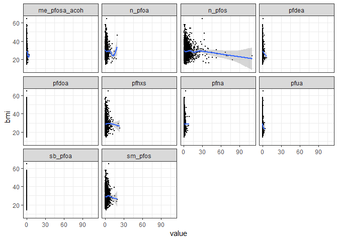
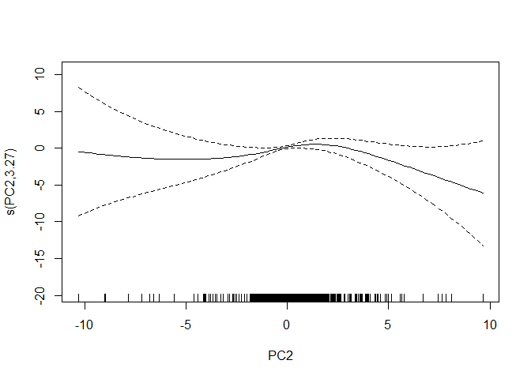

rnhanes\_nonlinear\_final
================
SL
April 17, 2019

-   [Tables](#tables)
-   [Plots](#plots)
-   [Correlations](#correlations)
-   [Linear](#linear)
    -   [Linear model](#linear-model)
-   [Natural Spline Term](#natural-spline-term)
    -   [glm natural spline](#glm-natural-spline)
    -   [gam natural spline](#gam-natural-spline)
-   [Penalized spline](#penalized-spline)
-   [PCA Loading Models](#pca-loading-models)
-   [Compare Models](#compare-models)

Load dataset from pipeline output

``` r
pfas <- read.csv("aamehs_data.csv") %>% 
   select(seqn, gender, age, race_ethnicity, hh_education, pfdea, pfhxs, me_pfosa_acoh, pfna, pfua, pfdoa, n_pfoa, sb_pfoa, n_pfos, sm_pfos, bmi) %>% 
  mutate(gender = factor(gender),
         race_ethnicity = factor(race_ethnicity),
         hh_education = factor(hh_education)) %>% 
  drop_na()
```

Tables
------

``` r
pfas %>% 
  select(gender, age, race_ethnicity, hh_education, bmi, everything(), -seqn) %>% 
  summary(.) 
```

    ##  gender       age        race_ethnicity hh_education      bmi       
    ##  1:933   Min.   :12.00   1:340          1:205        Min.   :14.50  
    ##  2:973   1st Qu.:25.00   2:246          2:230        1st Qu.:23.70  
    ##          Median :43.00   3:603          3:400        Median :27.80  
    ##          Mean   :43.43   4:429          4:615        Mean   :28.84  
    ##          3rd Qu.:61.00   6:207          5:456        3rd Qu.:32.77  
    ##          Max.   :80.00   7: 81                       Max.   :64.50  
    ##      pfdea            pfhxs        me_pfosa_acoh         pfna       
    ##  Min.   :0.0700   Min.   : 0.070   Min.   :0.0700   Min.   :0.0700  
    ##  1st Qu.:0.0700   1st Qu.: 0.600   1st Qu.:0.0700   1st Qu.:0.4000  
    ##  Median :0.1000   Median : 1.200   Median :0.0700   Median :0.6000  
    ##  Mean   :0.2531   Mean   : 1.610   Mean   :0.1704   Mean   :0.7747  
    ##  3rd Qu.:0.3000   3rd Qu.: 1.975   3rd Qu.:0.2000   3rd Qu.:1.0000  
    ##  Max.   :6.5000   Max.   :23.300   Max.   :4.2000   Max.   :8.4000  
    ##       pfua            pfdoa             n_pfoa         sb_pfoa       
    ##  Min.   :0.0700   Min.   :0.07000   Min.   : 0.07   Min.   :0.07000  
    ##  1st Qu.:0.0700   1st Qu.:0.07000   1st Qu.: 0.90   1st Qu.:0.07000  
    ##  Median :0.0700   Median :0.07000   Median : 1.40   Median :0.07000  
    ##  Mean   :0.1574   Mean   :0.07157   Mean   : 1.81   Mean   :0.07204  
    ##  3rd Qu.:0.2000   3rd Qu.:0.07000   3rd Qu.: 2.20   3rd Qu.:0.07000  
    ##  Max.   :4.2000   Max.   :0.30000   Max.   :19.20   Max.   :0.50000  
    ##      n_pfos           sm_pfos      
    ##  Min.   :  0.070   Min.   : 0.070  
    ##  1st Qu.:  1.800   1st Qu.: 0.700  
    ##  Median :  3.200   Median : 1.400  
    ##  Mean   :  5.127   Mean   : 1.948  
    ##  3rd Qu.:  5.800   3rd Qu.: 2.500  
    ##  Max.   :109.900   Max.   :19.200

Plots
-----

``` r
pfas %>%
    select(bmi, pfdea:sm_pfos) %>%
    gather(pfdea:sm_pfos, key = "variable", value = "value") %>% 
  ggplot(aes(value, bmi)) +
      geom_point(size = 0.5) +
    geom_smooth() +
    facet_wrap(~variable) +
    theme_bw()
```

    ## `geom_smooth()` using method = 'gam' and formula 'y ~ s(x, bs = "cs")'

    ## Warning: Computation failed in `stat_smooth()`:
    ## x has insufficient unique values to support 10 knots: reduce k.

    ## Warning: Computation failed in `stat_smooth()`:
    ## x has insufficient unique values to support 10 knots: reduce k.



Correlations
------------

``` r
cor_pfas <-
  pfas %>% 
    select(-bmi, -(seqn:hh_education)) %>% 
    scale() %>% 
    cor()
  


cor_pfas %>%
  corrplot::corrplot(., type = "upper",  method = "ellipse",
                        tl.col = "black", tl.srt = 90, tl.cex = 0.7,
                        addCoef.col = "black", number.cex = 0.7)
```


Linear
------

### Linear model

``` r
nest_lm_pfas <-
  pfas %>%
  gather(pfdea:sm_pfos, key = "chemical", value = "concentration") %>% 
  group_by(chemical) %>% 
  nest() %>% 
  mutate(models = map(data, ~lm(bmi ~ concentration + gender + age + race_ethnicity + hh_education, data = .x)),
         pred  = map2(data, models, modelr::add_predictions),
         resids = map2(data, models, add_residuals))


nest_lm_pfas %>% 
  mutate(models = map(models, broom::tidy)) %>% 
  select(-data, -pred, -resids) %>% 
  unnest() %>%  
  select(chemical, term, estimate) %>% 
  mutate(term = fct_inorder(term)) %>% 
  spread(key = term, value = estimate) %>% 
  knitr::kable(digits = 3)
```

| chemical        |  (Intercept)|  concentration|  gender2|    age|  race\_ethnicity2|  race\_ethnicity3|  race\_ethnicity4|  race\_ethnicity6|  race\_ethnicity7|  hh\_education2|  hh\_education3|  hh\_education4|  hh\_education5|
|:----------------|------------:|--------------:|--------:|------:|-----------------:|-----------------:|-----------------:|-----------------:|-----------------:|---------------:|---------------:|---------------:|---------------:|
| me\_pfosa\_acoh |       26.559|         -1.616|    0.930|  0.071|            -0.921|            -1.868|             0.197|            -4.992|            -0.039|           0.015|           0.800|           0.563|          -0.578|
| n\_pfoa         |       26.581|         -0.234|    0.886|  0.073|            -0.836|            -1.934|             0.172|            -4.935|            -0.081|           0.051|           0.806|           0.669|          -0.441|
| n\_pfos         |       26.481|         -0.067|    0.821|  0.076|            -0.832|            -1.931|             0.336|            -4.683|            -0.042|          -0.049|           0.670|           0.495|          -0.675|
| pfdea           |       26.526|         -0.850|    0.964|  0.071|            -0.891|            -1.991|             0.191|            -4.720|            -0.072|          -0.048|           0.685|           0.525|          -0.612|
| pfdoa           |       26.887|         -6.531|    0.965|  0.069|            -0.907|            -2.027|             0.113|            -5.042|            -0.117|           0.001|           0.744|           0.605|          -0.523|
| pfhxs           |       26.513|         -0.110|    0.890|  0.071|            -0.895|            -1.985|             0.134|            -5.075|            -0.109|          -0.006|           0.744|           0.625|          -0.512|
| pfna            |       26.579|         -0.463|    0.919|  0.073|            -0.848|            -2.020|             0.157|            -4.896|            -0.113|           0.009|           0.766|           0.622|          -0.517|
| pfua            |       26.570|         -2.162|    0.963|  0.071|            -0.845|            -1.944|             0.305|            -4.369|             0.022|          -0.039|           0.669|           0.494|          -0.652|
| sb\_pfoa        |       26.704|         -4.033|    0.965|  0.069|            -0.882|            -2.035|             0.111|            -5.069|            -0.142|          -0.006|           0.751|           0.612|          -0.522|
| sm\_pfos        |       26.454|         -0.178|    0.797|  0.076|            -0.875|            -1.944|             0.201|            -5.020|            -0.095|          -0.013|           0.744|           0.620|          -0.515|

``` r
nest_lm_pfas %>% 
  unnest(pred) %>% 
    ggplot(aes(concentration, pred)) +
      geom_point(size = 0.5) +
    geom_smooth(method = lm) +
    facet_wrap(~chemical) +
    scale_x_log10() +
    theme_bw()
```


Natural Spline Term
-------------------

### glm natural spline

``` r
ns_pfoa <- lm(bmi ~ ns(n_pfoa, df = 3) + gender + age + race_ethnicity + hh_education, data = pfas)

summary(ns_pfoa)
```

    ## 
    ## Call:
    ## lm(formula = bmi ~ ns(n_pfoa, df = 3) + gender + age + race_ethnicity + 
    ##     hh_education, data = pfas)
    ## 
    ## Residuals:
    ##     Min      1Q  Median      3Q     Max 
    ## -16.987  -4.605  -0.935   3.580  33.298 
    ## 
    ## Coefficients:
    ##                       Estimate Std. Error t value Pr(>|t|)    
    ## (Intercept)         27.6657195  0.8996435  30.752  < 2e-16 ***
    ## ns(n_pfoa, df = 3)1 -2.3997380  1.4423334  -1.664 0.096320 .  
    ## ns(n_pfoa, df = 3)2 -4.5840414  2.0464211  -2.240 0.025205 *  
    ## ns(n_pfoa, df = 3)3 -2.3645472  3.2981810  -0.717 0.473509    
    ## gender2              0.7165244  0.3207565   2.234 0.025609 *  
    ## age                  0.0754276  0.0080096   9.417  < 2e-16 ***
    ## race_ethnicity2     -0.7638053  0.5707065  -1.338 0.180943    
    ## race_ethnicity3     -1.8602982  0.4915444  -3.785 0.000159 ***
    ## race_ethnicity4      0.1821660  0.5123589   0.356 0.722222    
    ## race_ethnicity6     -4.8916615  0.6203941  -7.885 5.28e-15 ***
    ## race_ethnicity7      0.0009633  0.8434180   0.001 0.999089    
    ## hh_education2        0.0754323  0.6536177   0.115 0.908135    
    ## hh_education3        0.8425046  0.5972907   1.411 0.158544    
    ## hh_education4        0.7176630  0.5765140   1.245 0.213348    
    ## hh_education5       -0.3481321  0.6042465  -0.576 0.564587    
    ## ---
    ## Signif. codes:  0 '***' 0.001 '**' 0.01 '*' 0.05 '.' 0.1 ' ' 1
    ## 
    ## Residual standard error: 6.703 on 1891 degrees of freedom
    ## Multiple R-squared:  0.1105, Adjusted R-squared:  0.1039 
    ## F-statistic: 16.78 on 14 and 1891 DF,  p-value: < 2.2e-16

``` r
AIC(ns_pfoa)
```

    ## [1] 12678.37

``` r
ns_pfoa %>% 
  broom::tidy() %>% 
  select(-statistic) %>% 
  knitr::kable(digits = 3)
```

| term                 |  estimate|  std.error|  p.value|
|:---------------------|---------:|----------:|--------:|
| (Intercept)          |    27.666|      0.900|    0.000|
| ns(n\_pfoa, df = 3)1 |    -2.400|      1.442|    0.096|
| ns(n\_pfoa, df = 3)2 |    -4.584|      2.046|    0.025|
| ns(n\_pfoa, df = 3)3 |    -2.365|      3.298|    0.474|
| gender2              |     0.717|      0.321|    0.026|
| age                  |     0.075|      0.008|    0.000|
| race\_ethnicity2     |    -0.764|      0.571|    0.181|
| race\_ethnicity3     |    -1.860|      0.492|    0.000|
| race\_ethnicity4     |     0.182|      0.512|    0.722|
| race\_ethnicity6     |    -4.892|      0.620|    0.000|
| race\_ethnicity7     |     0.001|      0.843|    0.999|
| hh\_education2       |     0.075|      0.654|    0.908|
| hh\_education3       |     0.843|      0.597|    0.159|
| hh\_education4       |     0.718|      0.577|    0.213|
| hh\_education5       |    -0.348|      0.604|    0.565|

``` r
plot(ns_pfoa)
```


``` r
ns_pfoa %>% 
 predict(., se.fit = TRUE, type = "terms" ) %>% 
 as.data.frame(.) %>% 
  mutate(pred = fit.ns.n_pfoa..df...3.,
         se = se.fit.ns.n_pfoa..df...3.,
         lci = pred - 1.96*se,
         uci = pred + 1.96*se) %>%
  select(pred, se, lci, uci) %>% 
  bind_cols(pfas) %>% 
  mutate(pred_bmi = pred + mean(bmi),
         lci_bmi = lci + mean(bmi),
         uci_bmi = uci + mean(bmi)) %>% 
  ggplot(., aes(n_pfoa)) + 
      geom_line(aes(y = pred_bmi)) + 
      geom_line(aes(y = lci_bmi), color = "darkgrey") + 
      geom_line(aes(y = uci_bmi), color = "darkgrey") + 
      xlab("n_pfoa") + 
      ylab("Predicted BMI (95% CI)") +
      ylim(20,35)
```


### gam natural spline

``` r
pfoa_gam_ns <- gam(bmi ~ ns(n_pfoa, df = 3) + gender + age + race_ethnicity + hh_education, data = pfas)


summary(pfoa_gam_ns)
```

    ## 
    ## Family: gaussian 
    ## Link function: identity 
    ## 
    ## Formula:
    ## bmi ~ ns(n_pfoa, df = 3) + gender + age + race_ethnicity + hh_education
    ## 
    ## Parametric coefficients:
    ##                       Estimate Std. Error t value Pr(>|t|)    
    ## (Intercept)         27.6657195  0.8996435  30.752  < 2e-16 ***
    ## ns(n_pfoa, df = 3)1 -2.3997380  1.4423334  -1.664 0.096320 .  
    ## ns(n_pfoa, df = 3)2 -4.5840414  2.0464211  -2.240 0.025205 *  
    ## ns(n_pfoa, df = 3)3 -2.3645472  3.2981810  -0.717 0.473509    
    ## gender2              0.7165244  0.3207565   2.234 0.025609 *  
    ## age                  0.0754276  0.0080096   9.417  < 2e-16 ***
    ## race_ethnicity2     -0.7638053  0.5707065  -1.338 0.180943    
    ## race_ethnicity3     -1.8602982  0.4915444  -3.785 0.000159 ***
    ## race_ethnicity4      0.1821660  0.5123589   0.356 0.722222    
    ## race_ethnicity6     -4.8916615  0.6203941  -7.885 5.28e-15 ***
    ## race_ethnicity7      0.0009633  0.8434180   0.001 0.999089    
    ## hh_education2        0.0754323  0.6536177   0.115 0.908135    
    ## hh_education3        0.8425046  0.5972907   1.411 0.158544    
    ## hh_education4        0.7176630  0.5765140   1.245 0.213348    
    ## hh_education5       -0.3481321  0.6042465  -0.576 0.564587    
    ## ---
    ## Signif. codes:  0 '***' 0.001 '**' 0.01 '*' 0.05 '.' 0.1 ' ' 1
    ## 
    ## 
    ## R-sq.(adj) =  0.104   Deviance explained =   11%
    ## GCV = 45.284  Scale est. = 44.928    n = 1906

``` r
pfoa_gam_ns %>% 
 predict(., se.fit = TRUE, type = "terms" ) %>% 
 as.data.frame(.) %>% 
  mutate(pred = fit.ns.n_pfoa..df...3.,
         se = se.fit.ns.n_pfoa..df...3.,
         lci = pred - 1.96*se,
         uci = pred + 1.96*se) %>%
  select(pred, se, lci, uci) %>% 
  bind_cols(pfas) %>% 
  mutate(pred_bmi = pred + mean(bmi),
         lci_bmi = lci + mean(bmi),
         uci_bmi = uci + mean(bmi)) %>% 
  ggplot(., aes(n_pfoa)) + 
      geom_line(aes(y = pred_bmi)) + 
      geom_line(aes(y = lci_bmi), color = "darkgrey") + 
      geom_line(aes(y = uci_bmi), color = "darkgrey") + 
      xlab("n_pfoa") + 
      ylab("Predicted BMI (95% CI)") +
      ylim(20,35)
```

    ## Warning: Removed 1 rows containing missing values (geom_path).

 \`\`\`

Penalized spline
----------------

``` r
ps_pfoa <- gam(bmi ~ s(n_pfoa) + gender + age + race_ethnicity + hh_education, data = pfas)

summary(ps_pfoa)
```

    ## 
    ## Family: gaussian 
    ## Link function: identity 
    ## 
    ## Formula:
    ## bmi ~ s(n_pfoa) + gender + age + race_ethnicity + hh_education
    ## 
    ## Parametric coefficients:
    ##                  Estimate Std. Error t value Pr(>|t|)    
    ## (Intercept)     26.047159   0.658094  39.580  < 2e-16 ***
    ## gender2          0.717857   0.321951   2.230 0.025884 *  
    ## age              0.075392   0.008031   9.388  < 2e-16 ***
    ## race_ethnicity2 -0.752974   0.570807  -1.319 0.187282    
    ## race_ethnicity3 -1.852048   0.491909  -3.765 0.000172 ***
    ## race_ethnicity4  0.165183   0.512128   0.323 0.747078    
    ## race_ethnicity6 -4.855277   0.620356  -7.827 8.28e-15 ***
    ## race_ethnicity7 -0.004687   0.842761  -0.006 0.995563    
    ## hh_education2    0.081049   0.653014   0.124 0.901237    
    ## hh_education3    0.838389   0.596724   1.405 0.160190    
    ## hh_education4    0.693453   0.576004   1.204 0.228778    
    ## hh_education5   -0.369698   0.603720  -0.612 0.540369    
    ## ---
    ## Signif. codes:  0 '***' 0.001 '**' 0.01 '*' 0.05 '.' 0.1 ' ' 1
    ## 
    ## Approximate significance of smooth terms:
    ##             edf Ref.df     F p-value  
    ## s(n_pfoa) 6.093  7.099 2.113  0.0367 *
    ## ---
    ## Signif. codes:  0 '***' 0.001 '**' 0.01 '*' 0.05 '.' 0.1 ' ' 1
    ## 
    ## R-sq.(adj) =  0.106   Deviance explained = 11.4%
    ## GCV = 45.233  Scale est. = 44.804    n = 1906

``` r
ps_pfoa$sp   # extract Penalty 
```

    ##  s(n_pfoa) 
    ## 0.02025201

``` r
plot(ps_pfoa)
```


``` r
ps_pfoa %>% 
  broom::tidy() %>% 
  select(-statistic) %>% 
  knitr::kable(digits = 3)
```

| term       |    edf|  ref.df|  p.value|
|:-----------|------:|-------:|--------:|
| s(n\_pfoa) |  6.093|   7.099|    0.037|

``` r
ps_pfoa %>% 
 predict(., se.fit = TRUE, type = "terms" ) %>% 
 as.data.frame(.) %>% 
  mutate(pred = fit.s.n_pfoa.,
         se = se.fit.s.n_pfoa.,
         lci = pred - 1.96*se,
         uci = pred + 1.96*se) %>%
  select(pred, se, lci, uci) %>% 
  bind_cols(pfas) %>% 
  mutate(pred_bmi = pred + mean(bmi),
         lci_bmi = lci + mean(bmi),
         uci_bmi = uci + mean(bmi)) %>% 
  ggplot(., aes(n_pfoa)) + 
      geom_line(aes(y = pred_bmi)) + 
      geom_line(aes(y = lci_bmi), color = "darkgrey") + 
      geom_line(aes(y = uci_bmi), color = "darkgrey") + 
      xlab("n_pfoa") + 
      ylab("Predicted BMI (95% CI)") +
      ylim(20,35)
```

    ## Warning: Removed 1 rows containing missing values (geom_path).

    ## Warning: Removed 2 rows containing missing values (geom_path).


PCA Loading Models
------------------

``` r
pca_scores <- read.csv("pca_scores.csv")

pfas_pca <-
  left_join(pfas, pca_scores, by = "seqn") 
  
ps_pfas_pca <-
  gam(bmi ~ s(PC1) + s(PC2) + s(PC3) + gender + age + race_ethnicity + hh_education, data = pfas_pca)


summary(ps_pfas_pca)
```

    ## 
    ## Family: gaussian 
    ## Link function: identity 
    ## 
    ## Formula:
    ## bmi ~ s(PC1) + s(PC2) + s(PC3) + gender + age + race_ethnicity + 
    ##     hh_education
    ## 
    ## Parametric coefficients:
    ##                  Estimate Std. Error t value Pr(>|t|)    
    ## (Intercept)     25.757253   0.666975  38.618  < 2e-16 ***
    ## gender2          0.722899   0.328956   2.198 0.028102 *  
    ## age              0.081267   0.008672   9.371  < 2e-16 ***
    ## race_ethnicity2 -0.771553   0.571139  -1.351 0.176889    
    ## race_ethnicity3 -1.757708   0.492486  -3.569 0.000367 ***
    ## race_ethnicity4  0.422474   0.514424   0.821 0.411605    
    ## race_ethnicity6 -4.299530   0.652493  -6.589 5.71e-11 ***
    ## race_ethnicity7  0.161324   0.841925   0.192 0.848066    
    ## hh_education2   -0.031144   0.650994  -0.048 0.961848    
    ## hh_education3    0.783517   0.596395   1.314 0.189088    
    ## hh_education4    0.528756   0.575297   0.919 0.358160    
    ## hh_education5   -0.546868   0.602662  -0.907 0.364300    
    ## ---
    ## Signif. codes:  0 '***' 0.001 '**' 0.01 '*' 0.05 '.' 0.1 ' ' 1
    ## 
    ## Approximate significance of smooth terms:
    ##          edf Ref.df     F p-value  
    ## s(PC1) 5.349  6.488 2.415  0.0187 *
    ## s(PC2) 3.269  4.247 1.796  0.1201  
    ## s(PC3) 1.000  1.000 4.596  0.0322 *
    ## ---
    ## Signif. codes:  0 '***' 0.001 '**' 0.01 '*' 0.05 '.' 0.1 ' ' 1
    ## 
    ## R-sq.(adj) =  0.112   Deviance explained = 12.1%
    ## GCV =  45.04  Scale est. = 44.529    n = 1906

``` r
ps_pfas_pca$sp   # extract Penalty 
```

    ##       s(PC1)       s(PC2)       s(PC3) 
    ## 8.215298e-02 6.473024e-01 4.095268e+08

``` r
plot(ps_pfas_pca)
```



``` r
ps_pfas_pca %>% 
  broom::tidy() %>% 
  select(-statistic) %>% 
  knitr::kable(digits = 3)
```

| term   |    edf|  ref.df|  p.value|
|:-------|------:|-------:|--------:|
| s(PC1) |  5.349|   6.488|    0.019|
| s(PC2) |  3.269|   4.247|    0.120|
| s(PC3) |  1.000|   1.000|    0.032|

``` r
ps_pfoa %>% 
 predict(., se.fit = TRUE, type = "terms" ) %>% 
 as.data.frame(.) %>% 
  mutate(pred = fit.s.n_pfoa.,
         se = se.fit.s.n_pfoa.,
         lci = pred - 1.96*se,
         uci = pred + 1.96*se) %>%
  select(pred, se, lci, uci) %>% 
  bind_cols(pfas) %>% 
  mutate(pred_bmi = pred + mean(bmi),
         lci_bmi = lci + mean(bmi),
         uci_bmi = uci + mean(bmi)) %>% 
  ggplot(., aes(n_pfoa)) + 
      geom_line(aes(y = pred_bmi)) + 
      geom_line(aes(y = lci_bmi), color = "darkgrey") + 
      geom_line(aes(y = uci_bmi), color = "darkgrey") + 
      xlab("n_pfoa") + 
      ylab("Predicted BMI (95% CI)") +
      ylim(20,35)
```

    ## Warning: Removed 1 rows containing missing values (geom_path).

    ## Warning: Removed 2 rows containing missing values (geom_path).


Compare Models
--------------

``` r
broom::glance(pfoa_linear) %>% 
  bind_rows(broom::glance(ns_pfoa)) %>% 
  bind_rows(broom::glance(ps_pfoa)) %>% 
  bind_rows(broom::glance(ps_pfas_pca)) %>% 
  mutate(model = c("pfoa_linear", "pfoa_ns", "pfoa_ps", "pca3_ps")) %>% 
  select(model, everything()) %>% 
  knitr::kable()
```
